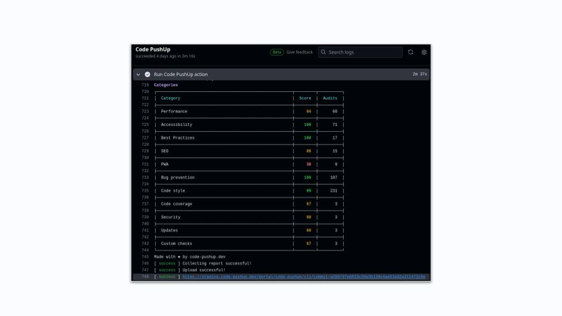
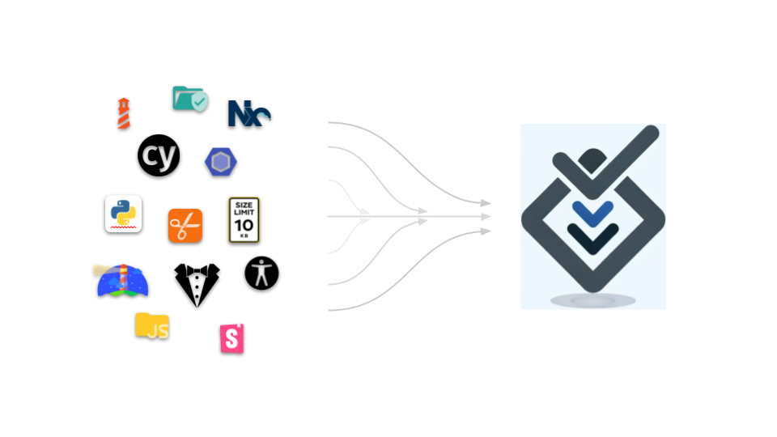

<h1 align="center">Code PushUp CLI</h1>

<h2 align="center">Comprehensive tech quality monitoring</h2>
<!-- link when web landing is ready <a href="./packages/cli/README.md#getting-started">Try our paid features</a> -->

Quantify tech debt &mdash; Track incremental improvements &mdash; Monitor regressions

---

---

### 🏷️ Category labels

See how your project measures up. With [portal integration](./packages/cli/README.md#portal-integration), category scores are embeddable and always reflect your latest report.

---

### 🔌 Code quality tools are like phone chargers. Everyone has a different plug.

_Common problems with keeping track of technical quality:_

- When **tech debt is invisible**, it's difficult to plan much-needed maintenance efforts 🔧
- Individual tools measure different metrics, the inability to combine them leads to a **lack of comprehensive overview** 🧑‍🦯
- Open-source tools typically used for failing checks in CI, which **can't measure incremental improvements** due to arbitrary pass/fail thresholds 🤖
- Off-the-shelf solutions tend to be opinionated and **hard to customize**, so may not fit your specific needs 🧱

_We want to change that!_

---

## 🔎🔬 Code quality integrations for any tool 📉🔍

| [🚀 Get started](./packages/cli/README.md#getting-started)️                                                                                                                                                   | [🤖 CI automation](https://github.com/marketplace/actions/code-pushup)                                                                                                                                                                       |
| ------------------------------------------------------------------------------------------------------------------------------------------------------------------------------------------------------------- | -------------------------------------------------------------------------------------------------------------------------------------------------------------------------------------------------------------------------------------------- |
|  |                                                                                |
| <ul><li>Run **[📦 `@code-pushup/cli`](./packages/cli#readme)** to collect **reports**.</li><li>Get started quickly with our [**official plugins**](#-officially-supported-plugins)! ⏱️</li></ul>              | <ul><li>Easy **CI** setup with **[🤖 `code-pushup/github-action`](https://github.com/marketplace/actions/code-pushup)**.</li><li>Import logic from **[📦 `@code-pushup/core`](./packages/core#readme)** to craft **custom tools**.</li></ul> |

| 📈 [Portal](https://code-pushup.dev/features)️                                                                                                                                                         | 🔌 [Custom plugins](./packages/cli/docs/custom-plugins.md)                                                                                                                                                                                                                    |
| ------------------------------------------------------------------------------------------------------------------------------------------------------------------------------------------------------ | ----------------------------------------------------------------------------------------------------------------------------------------------------------------------------------------------------------------------------------------------------------------------------- |
|  |                                                                                         |
| <ul><li>**[Portal](https://code-pushup.dev/features)** 🌐 **visualizes reports** in a slick UI.</li><li>Track **historical data** from uploads. ⬆️</li></ul>                                           | <ul><li>All the [data models](./packages/models/docs/models-reference.md) you need are provided in **[📦 `@code-pushup/models`](./packages/models/README.md)**.</li><li>Find tons of useful utilities in **[📦 `@code-pushup/utils`](./packages/utils/README.md)**.</li></ul> |

---

### 🔌 Officially supported plugins

|                              Icon                              | Name                                                | Description                                                                        |
| :------------------------------------------------------------: | :-------------------------------------------------- | :--------------------------------------------------------------------------------- |
|       | [ESLint](./packages/plugin-eslint#readme)           | Static analysis using **ESLint** rules.                                            |
|     | [Code Coverage](./packages/plugin-coverage#readme)  | Collects code **coverage** from your tests.                                        |
|  | [JS Packages](./packages/plugin-js-packages#readme) | Checks 3rd party packages for known **vulnerabilities** and **outdated** versions. |
|   | [Lighthouse](./packages/plugin-lighthouse#readme)   | Measures web performance and best practices with **Lighthouse**.                   |
|       | [JSDocs](./packages/plugin-jsdocs#readme)           | Analyzes how much source code is **documented** using JSDocs comments.             |
|   | [TypeScript](./packages/plugin-typescript#readme)   | Checks for **TypeScript** errors using strict compiler flags.                      |
|          | [Axe](./packages/plugin-axe#readme)                 | Detects accessibility issues using **Axe**.                                        |

---

## 📝 How it works

1. **[Configure](./packages/cli/README.md#getting-started)**  
   Pick from a set of supported packages or include your own ideas. 🧩

2. **[Integrate](https://github.com/marketplace/actions/code-pushup)**  
   Use our integration guide and packages to set up CI integration in minutes. ⏱️

3. **[Observe](https://code-pushup.dev/features)**  
   Guard regressions and track improvements with every code change. 🔍

4. **Relax!**  
   Watch improvements, share reports 📈

---

## 💖 Want to support us?

- Read how to contribute to the codebase. See: [CONTRIBUTING.md](./CONTRIBUTING.md) 🤝
<!-- link when sponsorships are ready [Sponsor](./CONTRIBUTING.md) -->
