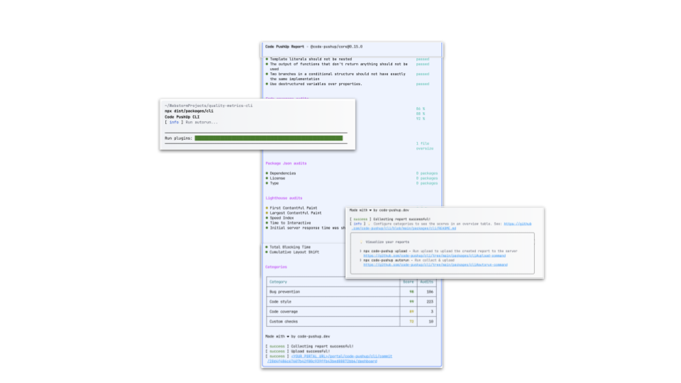
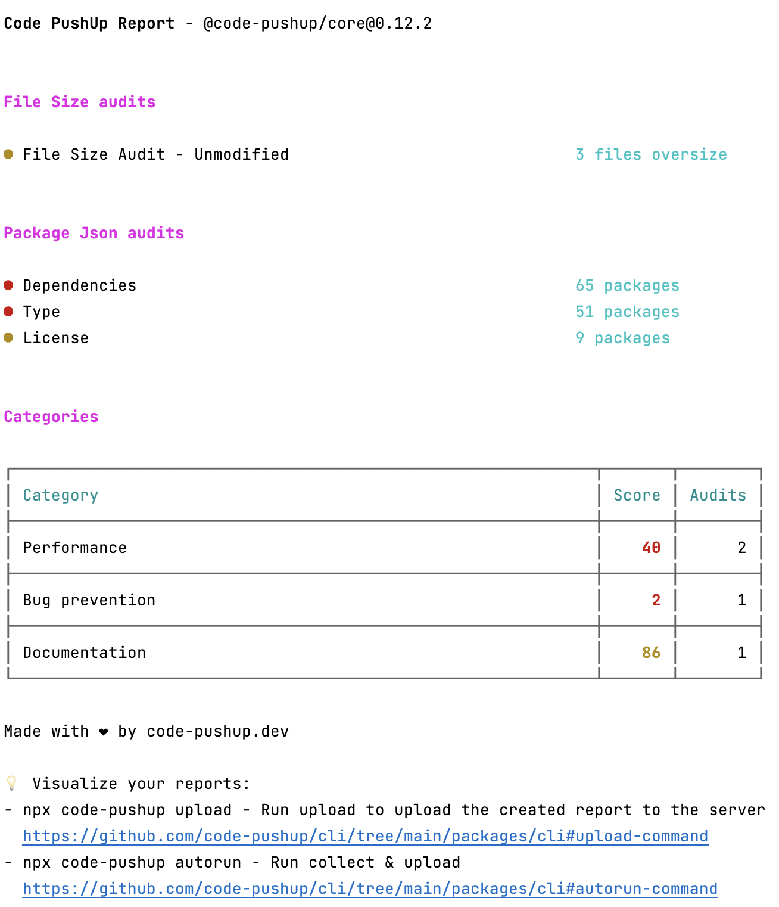

# Code PushUp CLI

<h1 align="center"> Just Follow the Score </h1>

<h2 align="center">🔎🔬Cost-effective codebase management for your every team member📉🔍</h2>

<table cellpadding="0" cellspacing="0" border="0">
<tr>
<td>
<h3>Code quality tools are like phone chargers. Everyone has a different plug.</h3>
<ul>
<li>
<b>Incomplete or missing tracking</b> due to a mix of portals and custom tools is costly and unreliable
</li>
<li>
<b>No Standards</b> in data and processes leads to flaky, self-maintained zombies
</li>
<li>
<b>Results are spread</b> over multiple places and need manual steps
</li>
</ul>
</td>
<td>

</td>
</tr>
</table>

<a href="https://code-pushup.dev/enterprise-support">Get enterprise support</a>

<h2>Standards for code quality that integrates any tool</h2>

<table cellpadding="0" cellspacing="0" border="0">
<tr>
<td>
<h3>Automated CI Integration</h3>
Seamlessly integration into any CI pipeline with full control. Our tool works on all platforms like GitHub, Gitlab, Bitbucket etc.
Get updates <a href="./packages/cli/README.md#-ci-automation">on every PR</a>! 
</td>
<td>

</td>
</tr>

<tr>
<td>
<h3>Zero config setup</h3>

<a href="./packages/cli#readme">📦 @code-pushup/cli</a>- <b>CLI</b> for <b>collecting</b> audit results and <b>uploading</b> report to portal.
<a href="./packages/cli/README.md#getting-started">Get started in no time</a>

</td>
<td>

</td>
</tr>

<tr>
<td>
<h3>Officially supported plugins </h3>
<ul>
<li><a href="./packages/plugin-eslint#readm">🧩 @code-pushup/eslint-plugin</a> 
Static analysis using <b>ESLint</b> rules
</li>
<li><a href="./packages/plugin-coverage#readm">🧩 @code-pushup/coverage-plugin</a> 
<b>Test Coverage</b> analysis
</li>
<li><a href="./packages/plugin-js-packages#readm">🧩 @code-pushup/js-packages-plugin</a> 
Package audit on <b>Security</b> and <b>Outdates</b>
</li>
<li><a href="./packages/plugin-lighthouse#readm">🧩 @code-pushup/lighthouse-plugin</a> 
web performance and best practices from <b>Lighthouse</b>
</li>
</ul>
</td>
<td>

</td>
</tr>

<tr>
<td>
<h3>Custom Plugins</h3>
<a href="./packages/cli/README.md#getting-started">Integrate your own metric with custom plugins</a> 
- Example plugins repo
- Docs
<a href="./packages/models#readme">📦 @code-pushup/models</a> <b>schemas and types</b> for data models (useful for custom plugins or other integrations
<a href="./packages/utils#readme">📦 @code-pushup/utils</a> - various <b>utilities</b> (useful for custom plugins or other integrations)

</td>
<td>

</td>
</tr>

</table>

<h2>How It Works!</h2>

<ol>
<li>
<b>Configure</b> 
Pick form a set of supported packages or include your own ideas.
</li>
<li>
<b>Integrate</b> 
Use our integration guide and packages to setup CI integration in minutes.
</li>
<li>
<b>Observe</b> 
Guard regressions and track improvements with every code change.
</li>
<li>
<b>Wing it!</b> 
Watch improve, share reports
</li>
</ol>

<table cellpadding="0" cellspacing="0" border="0">
<tr>
<td>

</td>
<td>
<h2>Just follow the score</h2>
<h3>See regressions - Report scores - On every PR</h3>
<a href="./packages/cli/README.md#getting-started">Try our paid features</a>

</td>
</tr>

</table>

Want to support us?

<ul>
<li><a href="./CONTRIBUTING.md">Contribute</a></li>
<li><a href="">Sponsor</a></li>
</ul>
