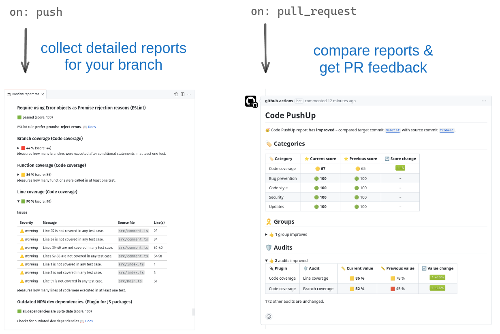
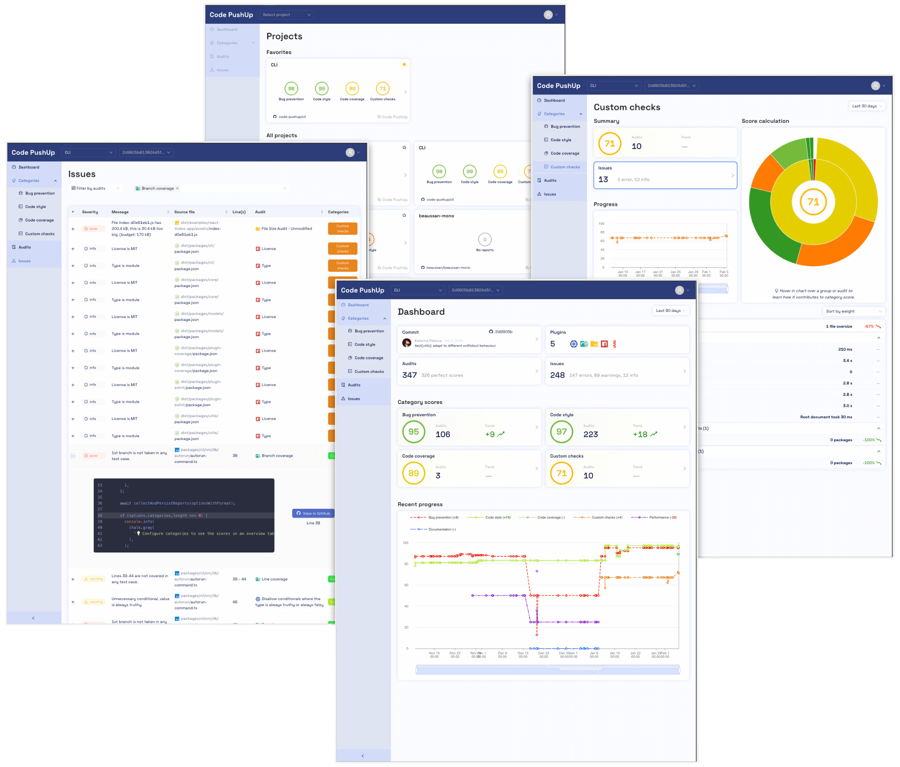
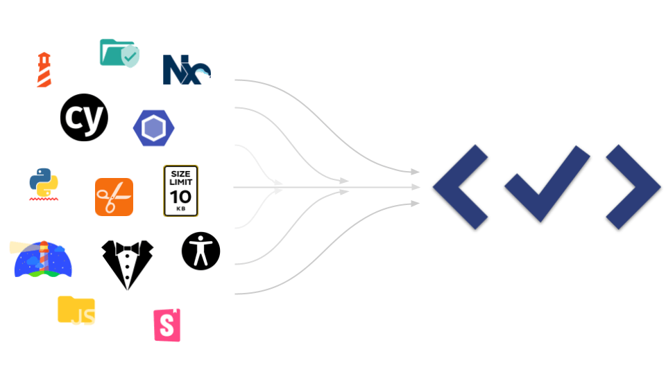

# Code PushUp CLI

**Just Follow the Score <✓>**

#### 🔌 Code quality tools are like phone chargers. Everyone has a different plug.

- **Incomplete or missing tracking** due to a mix of portals and custom tools is costly and unreliable 💸
- **No Standards** in data and processes leads to flaky, unmaintained zombies 🧟
- **Results are spread** over multiple places and need manual steps 📂

---

## 🔎🔬 Code quality integrations for any tool 📉🔍

| [🚀 Get started](./packages/cli/README.md#getting-started)️                                                                                                                                            | 🤖 Automated CI Integration                                                                                                                                                                                                                     |
| ------------------------------------------------------------------------------------------------------------------------------------------------------------------------------------------------------ | ----------------------------------------------------------------------------------------------------------------------------------------------------------------------------------------------------------------------------------------------- |
|  |                                                                                          |
| <ul><li>**[Set up th 📦 CLI](./packages/cli#readme)** to **collect** audit results and **upload** reports.</li><li>[Get started in no time!](./packages/cli/README.md#getting-started) ⏱️</li></ul>    | <ul><li>Use our <a href="https://github.com/code-pushup/github-action">🤖 GitHub Action</a> for integrating into your CI workflows.</li><li>**The [📦 Core package](./packages/core#readme)** helps to craft your **custom tooling**.</li></ul> |

| 📈 [Portal](https://code-pushup.dev#portal)️                                                                                                                                                                                               | 🔌 [Custom plugins](./packages/cli/docs/custom-plugins.md)                                                                                                                        |
| ------------------------------------------------------------------------------------------------------------------------------------------------------------------------------------------------------------------------------------------ | --------------------------------------------------------------------------------------------------------------------------------------------------------------------------------- |
|                                            |  |
| <ul><li><a href="https://code-pushup.dev#portal">Our portal</a> provides historical data and a slick UI</li><li>The <a href="https://www.npmjs.com/package/@code-pushup/portal-client">portal-client</a> helps to upload reports</li></ul> |                                                                                                                                                                                   |

---

### 🔌 Officially Supported Plugins

|                                                                |                                                     |                                                        |
| -------------------------------------------------------------- | --------------------------------------------------- | ------------------------------------------------------ |
|       | [Eslint](./packages/plugin-eslint#readme)           | Static analysis using **ESLint** rules                 |
|     | [Coverage](./packages/plugin-coverage#readme)       | **Test Coverage** analysis                             |
|  | [JS Packages](./packages/plugin-js-packages#readme) | Package audit on **Security** and **Outdates**         |
|   | [Lighthouse](./packages/plugin-lighthouse#readme)   | Web performance and best practices from **Lighthouse** |

---

## 📝 How It Works!

1. **Configure**  
   Pick from a set of supported packages or include your own ideas. 🧩

2. **Integrate**  
   Use our integration guide and packages to set up CI integration in minutes. ⏱️

3. **Observe**  
   Guard regressions and track improvements with every code change. 🔍

4. **Wing it!**  
   Watch improvements, share reports 📈

---

<table>
<tr>
<td>
 
</td>
<td>
<h2>Just follow the score</h2>
<h3>See regressions - Report scores - On every PR</h3>
<!-- link when web landing is ready <a href="./packages/cli/README.md#getting-started">Try our paid features</a> -->
</td>
</tr>
</table>

## 💖 Want to support us?

- Read how to contribute to the codebase. See: [CONTRIBUTING.md](./CONTRIBUTING.md) 🤝
<!-- link when sponsorships are ready [Sponsor](./CONTRIBUTING.md) -->
