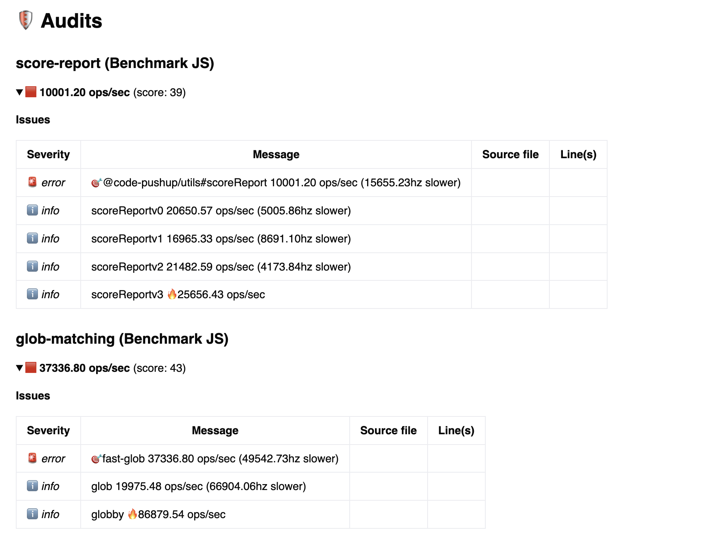

# benchmark js example

🕵️️ **Code PushUp plugin to benchmark JS execution performance** 📊

---

The plugin analyzes a given suit name and creates benchmark audits.  
It uses [tinybench](https://github.com/tinylibs/tinybench) under the hood.

You can configure the plugin with the following options:

- `targets` - files to load that export a suit
- `tsconfig` - path to tsconfig file _(optional)_
- `logs` - additional information _(optional)_

## Getting started

1. If you haven't already, install [@code-pushup/cli](../../../../packages/cli/README.md) and create a configuration file.

2. Copy the [plugin source](./src/) as is into your project

3. Add this plugin to the `plugins` array in your Code PushUp CLI config file (e.g. `code-pushup.config.js`).

   Pass in the path on the directory to load the test suite form (relative to `process.cwd()`), for more options see [BenchmarkJsPluginOptions]().

   ```js
   import { join } from 'node:path';
   import benchmarkJsPlugin from './benchmark-js.plugin';

   export default {
     // ...
     plugins: [
       // ...
       await benchmarkJsPlugin({
         targets: ['suits/score-report.ts'],
       }),
     ],
   };
   ```

3.1. Create benchmark suite:

```ts
// typescript
const suitConfig = {
  suitName: 'glob',
  targetImplementation: 'version-2',
  cases: [
    ['version-1', () => new Promise(resolve => setTimeout(resolve, 30))],
    ['version-2', () => new Promise(resolve => setTimeout(resolve, 10))],
    ['version-3', () => new Promise(resolve => setTimeout(resolve, 20))],
  ],
};
```

4. (Optional) Set up categories (use `npx code-pushup print-config` to list audits and groups).

   ```js
   import benchmarkJsPlugin, { suitesToCategorieGroupRef } from './benchmark-js.plugin';

   export default {
     // ...
     categories: [
       // ...
       {
         slug: 'performance',
         title: 'Performance',
         refs: suitesToCategorieGroupRef(suites),
       },
     ],
   };
   ```

5. Run the CLI with `npx code-pushup collect` and view or upload report (refer to [CLI docs](../../../../packages/cli/README.m)).

For a standalone usage uf the test runner use our helpers

## Audits

The plugin creates an audit for each suite.

The audit scoring is based on fastest case, that means the fastest audit has a score of 100.
If the target implementation is not the fastest, the audit shows how much slower the target implementation is compared to the fastest.

`● crawl-file-system - Benchmark JS           59.9 ops/sec`

### Issues

Each audit has the test cases listed as issue.

**Possible issues:**

- is slower - `version-1    59.90 ops/sec (20% slower)`
- is target and slower - `🎯 version-1    59.90 ops/sec (20% slower)`
- is fastest - `version-1     59.90 ops/sec 🔥 `
- is target and fastest - `🎯 version-1     59.90 ops/sec 🔥`



## Standalone helper

The plugin also provides a helper function to execute a test suit.

```ts
import { SuiteConfig, runSuit } from './suite-helper.ts';

const suite: SuiteConfig = {
  suiteName: 'dummy-suite',
  targetImplementation: 'version-2',
  cases: [
    ['version-1', async () => new Promise(resolve => setTimeout(resolve, 30))],
    ['version-2', async () => new Promise(resolve => setTimeout(resolve, 50))],
    ['version-3', async () => new Promise(resolve => setTimeout(resolve, 80))],
  ],
};
const results = await runSuite(suite);

const { suiteName, name, hz: maxHz } = results.find(({ isFastest }) => isFastest);
const target = results.find(({ isTarget }) => isTarget);
console.log(`In suite ${suiteName} fastest is: ${name} target is ${target?.name}`);
console.table(
  results.map(({ name, hz, rme, samples, isTarget, isFastest }) => {
    const targetIcon = isTarget ? '🎯' : '';
    const postfix = isFastest ? '(fastest 🔥)' : `(${((1 - hz / maxHz) * 100).toFixed(1)}% slower)`;
    return {
      // fast-glob x 40,824 ops/sec ±4.44% (85 runs sampled)
      message: `${targetIcon}${name} x ${hz.toFixed(2)} ops/sec ±${rme.toFixed(2)}; ${samples} samples ${postfix}`,
      severity: hz < maxHz && isTarget ? 'error' : 'info',
    };
  }),
);
```
