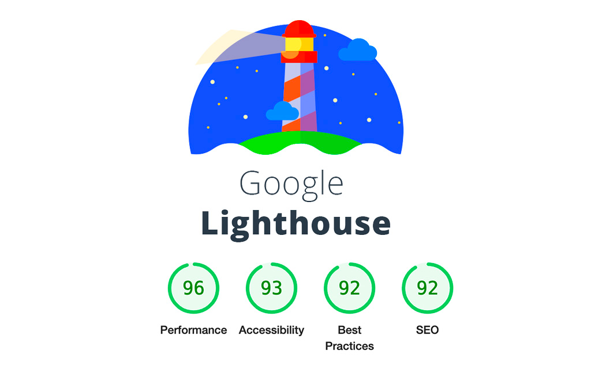

# lighthouse-plugin example

🕵️ **Code PushUp plugin for Lighthouse reports** 🔥

---

> [!NOTE]
> The real implementation of lighthouse lives [here](../../../../packages/plugin-lighthouse)



The plugin analyzes a given URL and creates Lighthouse audits.

You can configure the plugin with the following options:

- `url` - target to crawl
- `outputPath` - path to lighthouse report in json format _(optional)_
- `onlyAudits` - list of audits to run _(optional)_
- `verbose` - additional information _(optional)_
- `headless` - run headless _(optional)_

## Getting started

1. If you haven't already, install [@code-pushup/cli](../../../../packages/cli/README.md) and create a configuration file.

2. Copy the [plugin source](./src/) as is into your project

3. Add this plugin to the `plugins` array in your Code PushUp CLI config file (e.g. `code-pushup.config.js`).

   Pass in the path on the directory to crawl (relative to `process.cwd()`), as well as patterns and a budget.

   ```js
   import path from 'node:path';
   import { LIGHTHOUSE_OUTPUT_FILE_DEFAULT } from './lighthouse-plugin.constants';
   import lighthousePlugin from './lighthouse.plugin';

   export default {
     // ...
     plugins: [
       // ...
       lighthousePlugin({
         url: 'https://example.com',
         outputPath: path.join('.code-pushup', LIGHTHOUSE_OUTPUT_FILE_DEFAULT),
       }),
     ],
   };
   ```

4. (Optional) Set up categories (use `npx code-pushup print-config` to list audits and groups).

   ```js
   import fileSizePlugin, { recommendedRefs as lighthouseRecommendedRefs } from './lighthouse.plugin';

   export default {
     // ...
     categories: [
       // ...
       {
         slug: 'performance',
         title: 'Performance',
         refs: lighthouseRecommendedRefs,
       },
     ],
   };
   ```

5. Run the CLI with `npx code-pushup collect` and view or upload report (refer to [CLI docs](../../../../packages/cli/README.m)).

## Audits

Detailed information about the audits can be found in the docs of [Lighthouse](https://developer.chrome.com/docs/lighthouse/overview/).
