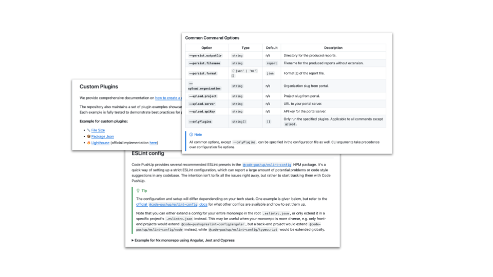
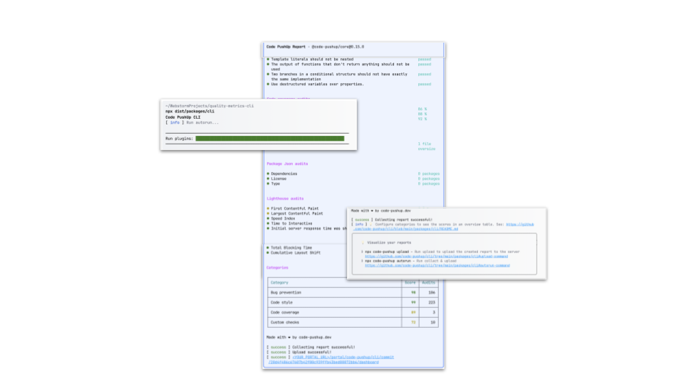
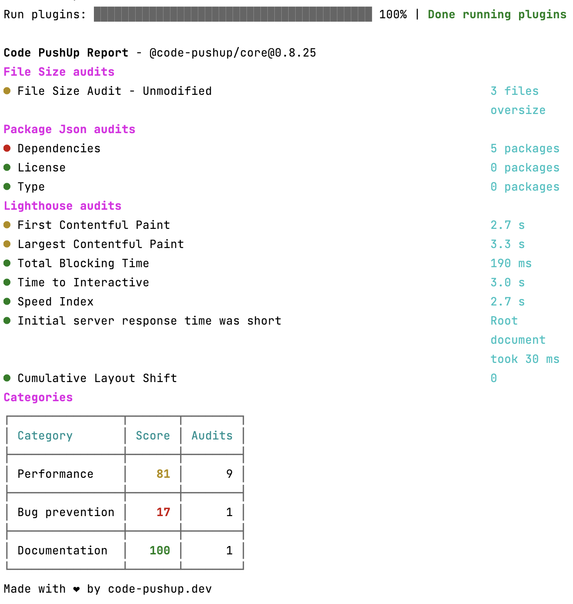

# @code-pushup/cli

[](https://www.npmjs.com/package/@code-pushup/cli)
[](https://npmtrends.com/@code-pushup/cli)
[](https://www.npmjs.com/package/@code-pushup/cli?activeTab=dependencies)

🔎🔬 **Quality metrics for your software project.** 📉🔍

1. ⚙️ **Configure what you want to track using your favourite tools.**
2. 🤖 **Integrate it in your CI.**
3. 🌈 **Visualize reports in a beautiful dashboard.**

---

|                                                                                     📊 Getting Started                                                                                      |                                                                                 🌐 Portal Integration                                                                                 |                                                                     🛠️ CI Automation                                                                      |
| :-----------------------------------------------------------------------------------------------------------------------------------------------------------------------------------------: | :-----------------------------------------------------------------------------------------------------------------------------------------------------------------------------------: | :-------------------------------------------------------------------------------------------------------------------------------------------------------: |
|                                                                    **[How to setup](#getting-started)** a basic project                                                                     |                                                                  Sort, filter **[your goals](#portal-integration)**                                                                   |                                                        Updates **[on every PR](#-ci-automation)**                                                         |
| <a href="#getting-started"></a> | <a href="#portal-integration"></a> | <a href="#-ci-automation"></a> |

---

The Code PushUp CLI serves to **collect audit results**, and optionally **upload the report** to the Code PushUp portal.

It can be used locally in your repository, or integrated in your CI environment.

_If you're looking for programmatic usage, then refer to the underlying [@code-pushup/core](../core/README.md) package instead._

## Getting started

1. Install as a dev dependency with your package manager:
   <details>
   <summary>Installation command for <code>npm</code>, <code>yarn</code> and <code>pnpm</code></summary>

   ```sh
   npm install --save-dev @code-pushup/cli
   ```

   ```sh
   yarn add --dev @code-pushup/cli
   ```

   ```sh
   pnpm add --save-dev @code-pushup/cli
   ```

   </details>

2. Create a `code-pushup.config.ts` configuration file (`.js` or `.mjs` extensions are also supported).

   ```ts
   import type { CoreConfig } from '@code-pushup/models';

   const config: CoreConfig = {
     plugins: [
       // ...
     ],
   };

   export default config;
   ```

3. Add plugins as per your project needs (e.g. [@code-pushup/eslint-plugin](../plugin-eslint/README.md) or [@code-pushup/coverage-plugin](../plugin-coverage/README.md)).

   ```sh
   npm install --save-dev @code-pushup/eslint-plugin
   ```

   ```ts
   import eslintPlugin from '@code-pushup/eslint-plugin';
   import type { CoreConfig } from '@code-pushup/models';

   const config: CoreConfig = {
     // ...
     plugins: [
       // ...
       await eslintPlugin({ eslintrc: '.eslintrc.js', patterns: ['src/**/*.js'] }),
     ],
   };

   export default config;
   ```

4. Run the CLI with `npx code-pushup` (see `--help` for list of commands and arguments).

5. View report file(s) in output directory (specified by `persist.outputDir` configuration).  
   This folder should be ignored in your `.gitignore`.

### Set up categories (optional)

1. Define your custom categories.

   ```ts
   const config: CoreConfig = {
     // ...
     categories: [
       {
         slug: 'performance',
         title: 'Performance',
         refs: [
           // reference to an existing audit or group from plugins
           {
             type: 'audit',
             plugin: 'eslint',
             slug: 'react-jsx-key',
             weight: 1,
           },
           // ...
         ],
       },
       // ...
     ],
   };
   ```

2. Run the CLI with `npx code-pushup`.

3. View report file(s) including category section in output directory.

## Portal integration

If you have access to the Code PushUp portal, you can enable report uploads by installing the `@code-pushup/portal-client` package.

<details>
<summary>Installation command for <code>npm</code>, <code>yarn</code> and <code>pnpm</code></summary>

```sh
npm install --save-dev @code-pushup/portal-client
```

```sh
yarn add --dev @code-pushup/portal-client
```

```sh
pnpm add --save-dev @code-pushup/portal-client
```

</details>

Once the package is installed, update your configuration file to include your portal credentials:

```ts
const config: CoreConfig = {
  // ...
  upload: {
    server: 'https://ip-or-domain/path/to/portal/api/graphql',
    apiKey: process.env.PORTAL_API_KEY,
    organization: 'my-org',
    project: 'my-project',
  },
};
```

## 🛠 CI automation

Example for GitHub Actions:

```yml
name: Code PushUp

on: push

jobs:
  collect-and-upload:
    runs-on: ubuntu-latest
    steps:
      - uses: actions/checkout@v4
      - uses: actions/setup-node@v4
      - run: npm ci
      - run: npx code-pushup autorun --upload.apiKey=${{ secrets.PORTAL_API_KEY }}
```

## Configuration

For a comprehensive list of all options available in the config file, refer to [`CoreConfig` docs](../models/docs/models-reference.md#coreconfig).

The default locations for the config file are `code-pushup.config.ts`, `code-pushup.config.mjs` or `code-pushup.config.js`. Other locations require using the `--config=<path>` CLI option.

If your config file relies on some custom TypeScript project configuration - e.g. import aliases via [compilerOptions.paths](https://www.typescriptlang.org/tsconfig#paths) (common in Nx) - you can use the `--tsconfig=<path>` CLI option.

## Custom Plugins

We provide comprehensive documentation on [how to create a custom plugin](./docs/custom-plugins.md).

The repository also maintains a set of plugin examples showcasing different scenarios.  
Each example is fully tested to demonstrate best practices for plugin testing as well.

**Example for custom plugins:**

- 📏 [File Size](../../examples/plugins/src/file-size) - example of basic runner executor
- 📦 [Package Json](../../examples/plugins/src/package-json) - example of audits and groups
- 🔥 [Lighthouse](../../examples/plugins/src/lighthouse) (official implementation [here](../../../../packages/plugin-lighthouse)) - example of a basic command executor

## CLI commands and options

### Global Options

| Option           | Type      | Default                                      | Description                                                                                                                |
| ---------------- | --------- | -------------------------------------------- | -------------------------------------------------------------------------------------------------------------------------- |
| **`--progress`** | `boolean` | `false` in CI, otherwise `true`              | Show progress bar in stdout.                                                                                               |
| **`--verbose`**  | `boolean` | `false`                                      | When true creates more verbose output. This is helpful when debugging. You may also set `CP_VERBOSE` env variable instead. |
| **`--config`**   | `string`  | looks for `code-pushup.config.{ts\|mjs\|js}` | Path to config file.                                                                                                       |
| **`--tsconfig`** | `string`  | n/a                                          | Path to a TypeScript config, used to load config file.                                                                     |

> [!NOTE]  
> By default, the CLI loads `code-pushup.config.(ts|mjs|js)` if no config path is provided with `--config`.

### Common Command Options

#### Global Options

| Option              | Type       | Default | Description                                                                 |
| ------------------- | ---------- | ------- | --------------------------------------------------------------------------- |
| **`--onlyPlugins`** | `string[]` | `[]`    | Only run the specified plugins. Applicable to all commands except `upload`. |
| **`--skipPlugins`** | `string[]` | `[]`    | Skip the specified plugins. Applicable to all commands except `upload`.     |

#### Cache Options

| Option              | Type      | Default | Description                                                     |
| ------------------- | --------- | ------- | --------------------------------------------------------------- |
| **`--cache`**       | `boolean` | `false` | Cache runner outputs (both read and write).                     |
| **`--cache.read`**  | `boolean` | `false` | If plugin audit outputs should be read from file system cache.  |
| **`--cache.write`** | `boolean` | `false` | If plugin audit outputs should be written to file system cache. |

#### Persist Options

| Option                      | Type                 | Default  | Description                                                        |
| --------------------------- | -------------------- | -------- | ------------------------------------------------------------------ |
| **`--persist.outputDir`**   | `string`             | n/a      | Directory for the produced reports.                                |
| **`--persist.filename`**    | `string`             | `report` | Filename for the produced reports without extension.               |
| **`--persist.format`**      | `('json' \| 'md')[]` | `json`   | Format(s) of the report file.                                      |
| **`--persist.skipReports`** | `boolean`            | `false`  | Skip generating report files. (useful in combination with caching) |

#### Upload Options

| Option                      | Type     | Default | Description                    |
| --------------------------- | -------- | ------- | ------------------------------ |
| **`--upload.organization`** | `string` | n/a     | Organization slug from portal. |
| **`--upload.project`**      | `string` | n/a     | Project slug from portal.      |
| **`--upload.server`**       | `string` | n/a     | URL to your portal server.     |
| **`--upload.apiKey`**       | `string` | n/a     | API key for the portal server. |

> [!NOTE]  
> All common options, except `--onlyPlugins` and `--skipPlugins`, can be specified in the configuration file as well.
> CLI arguments take precedence over configuration file options.

> [!NOTE]  
> The `--upload.*` group of options is applicable to all commands except `collect`.

### Commands

#### `collect` command



Usage:
`code-pushup collect [options]`

Description:
The command initializes and executes the necessary plugins and collects the results. Based on the results it generates a comprehensive report.

Refer to the [Common Command Options](#common-command-options) for the list of available options.

#### `upload` command

Usage:
`code-pushup upload [options]`

Description:
Upload reports to the Code PushUp portal.

Refer to the [Common Command Options](#common-command-options) for the list of available options.

#### `autorun` command

Usage:
`code-pushup autorun [options]`

Description:
Run plugins, collect results and upload the report to the Code PushUp portal.

Refer to the [Common Command Options](#common-command-options) for the list of available options.

#### `history` command

Usage:
`code-pushup history`

Description:
Run plugins, collect results and upload the report to the Code PushUp portal for a specified number of commits.

Refer to the [Common Command Options](#common-command-options) for the list of available options.

| Option                   | Type      | Default | Description                                                      |
| ------------------------ | --------- | ------- | ---------------------------------------------------------------- |
| **`--targetBranch`**     | `string`  | 'main'  | Branch to crawl history.                                         |
| **`--forceCleanStatus`** | `boolean` | `false` | If we reset the status to a clean git history forcefully or not. |
| **`--maxCount`**         | `number`  | 5       | Number of commits.                                               |
| **`--skipUploads`**      | `boolean` | `false` | Upload created reports                                           |
| **`--from`**             | `string`  | n/a     | Hash to start in history                                         |
| **`--to`**               | `string`  | n/a     | Hash to end in history                                           |

#### `compare` command

Usage:
`code-pushup compare --before SOURCE_PATH --after TARGET_PATH [options]`

Description:
Compare 2 reports and produce a report diff file.

In addition to the [Common Command Options](#common-command-options), the following options are recognized by the `compare` command:

| Option         | Type     | Default                                | Description                         |
| -------------- | -------- | -------------------------------------- | ----------------------------------- |
| **`--before`** | `string` | `.code-pushup/report-before.json` [^1] | Path to source `report.json`.       |
| **`--after`**  | `string` | `.code-pushup/report-after.json` [^1]  | Path to target `report.json`.       |
| **`--label`**  | `string` | n/a [^2]                               | Label for diff (e.g. project name). |

[^1]: Uses `persist` config to determine report paths, so default file paths are actually `${persist.outputDir}/${persist.filename}-before.json` and `${persist.outputDir}/${persist.filename}-after.json`.

[^2]: Uses `label` from input `report.json` files is they both have the same value.

#### `print-config` command

Usage:
`code-pushup print-config [options]`

Description:
Print the resolved configuration.

In addition to the [Common Command Options](#common-command-options), the following options are recognized by the `print-config` command:

| Option         | Required | Type     | Description                                              |
| -------------- | :------: | -------- | -------------------------------------------------------- |
| **`--output`** |    no    | `string` | Path to output file to print config (default is stdout). |

#### `merge-diffs` command

Usage:
`code-pushup merge-diffs --files PATH_1 PATH_2 ... [options]`

Description:
Combine multiple report diffs into a single `report-diff.md`.

In addition to the [Common Command Options](#common-command-options), the following options are recognized by the `merge-diffs` command:

| Option        | Required | Type       | Description                       |
| ------------- | :------: | ---------- | --------------------------------- |
| **`--files`** |   yes    | `string[]` | List of `report-diff.json` paths. |

## Caching

The CLI supports caching to speed up subsequent runs and is compatible with Nx and Turborepo.

Depending on your strategy, you can cache the generated reports files or plugin runner output.
For fine-grained caching, we suggest caching plugin runner output.

The detailed example for [Nx caching](./docs/nx-caching.md) and [Turborepo caching](./docs/turbo-caching.md) is available in the docs.
