# Caching Example Nx

To cache plugin runner output, you can use the `--cache.write` and `--cache.read` options in combination with `--onlyPlugins` and `--persist.skipReports` command options.

## `{projectRoot}/code-pushup.config.ts`

```ts
import coveragePlugin from '@code-pushup/coverage-plugin';
import jsPackagesPlugin from '@code-pushup/js-packages-plugin';
import type { CoreConfig } from '@code-pushup/models';

export default {
  plugins: [
    await coveragePlugin({
      reports: ['coverage/lcov.info'],
    }),
    await jsPackagesPlugin(),
  ],
  upload: {
    server: 'https://api.code-pushup.example.com/graphql',
    organization: 'my-org',
    project: 'lib-a',
    apiKey: process.env.CP_API_KEY,
  },
} satisfies CoreConfig;
```

## `{projectRoot}/project.json`

```json
{
  "name": "lib-a",
  "targets": {
    "int-test": {
      "cache": true,
      "outputs": ["{options.coverage.reportsDirectory}"],
      "executor": "@nx/vite:test",
      "options": {
        "configFile": "packages/lib-a/vitest.int.config.ts",
        "coverage.reportsDirectory": "{projectRoot}/coverage/int-test"
      }
    },
    "unit-test": {
      "cache": true,
      "outputs": ["{options.coverage.reportsDirectory}"],
      "executor": "@nx/vite:test",
      "options": {
        "configFile": "packages/lib-a/vitest.unit.config.ts",
        "coverage.reportsDirectory": "{projectRoot}/coverage/unit-test"
      }
    },
    "code-pushup-coverage": {
      "cache": true,
      "outputs": ["{options.persist.outputDir}/coverage"],
      "executor": "nx:run-commands",
      "options": {
        "command": "npx @code-pushup/cli collect",
        "config": "{projectRoot}/code-pushup.config.ts",
        "cache": {
          "write": true
        },
        "persist": {
          "skipReports": true,
          "outputDir": "{projectRoot}/.code-pushup"
        },
        "upload": {
          "project": "{projectName}"
        }
      },
      "dependsOn": ["unit-test", "int-test"]
    },
    "code-pushup": {
      "cache": true,
      "outputs": ["{options.persist.outputDir}"],
      "executor": "nx:run-commands",
      "options": {
        "command": "npx @code-pushup/cli",
        "config": "{projectRoot}/code-pushup.config.ts",
        "cache": {
          "read": true
        },
        "persist": {
          "outputDir": ".code-pushup"
        },
        "upload": {
          "project": "{projectName}"
        }
      },
      "dependsOn": ["code-pushup:coverage"]
    }
  }
}
```

## Nx Task Graph

This configuration creates the following task dependency graph:

**Legend:**

- 🐳 = Cached target

```mermaid
graph TD
  A[lib-a:code-pushup 🐳] --> B[lib-a:code-pushup-coverage 🐳]
  B --> C[lib-a:unit-test 🐳]
  B --> D[lib-a:int-test 🐳]
```



## Command Line Example

```bash
# Run all affected project plugins `coverage` and cache the output if configured
nx affected --target=code-pushup-coverage

# Run all affected projects with plugins `coverage` and `js-packages` and upload the report to the portal
nx affected --target=code-pushup
```

This approach has the following benefits:

1. **Parallel Execution**: Plugins can run in parallel
2. **Finegrained Caching**: Code level cache invalidation enables usage of [affected](https://nx.dev/recipes/affected-tasks) command
3. **Dependency Management**: Leverage Nx task dependencies and its caching strategy
4. **Clear Separation**: Each plugin has its own target for better debugging and maintainability
