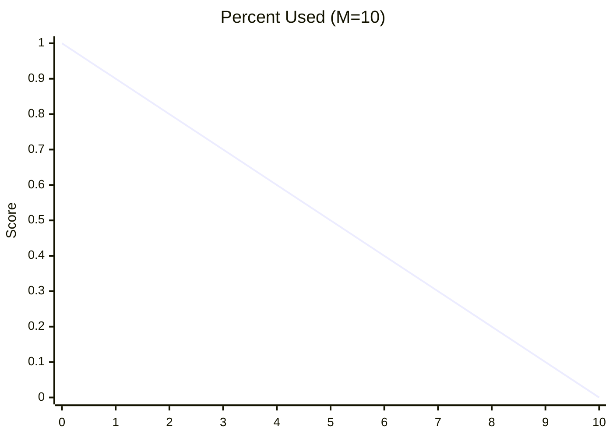
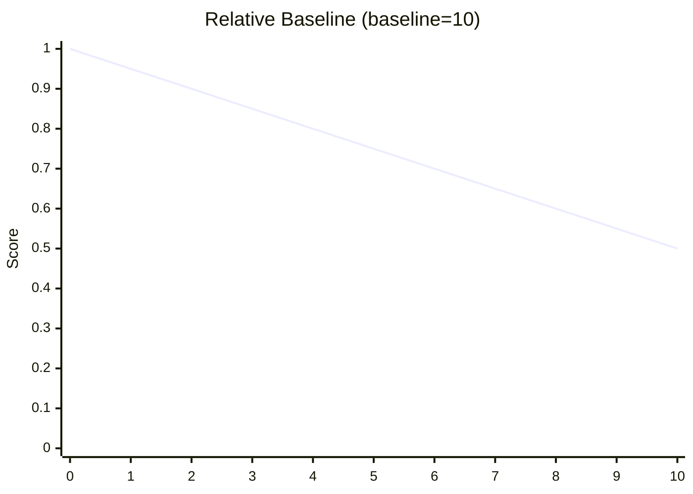
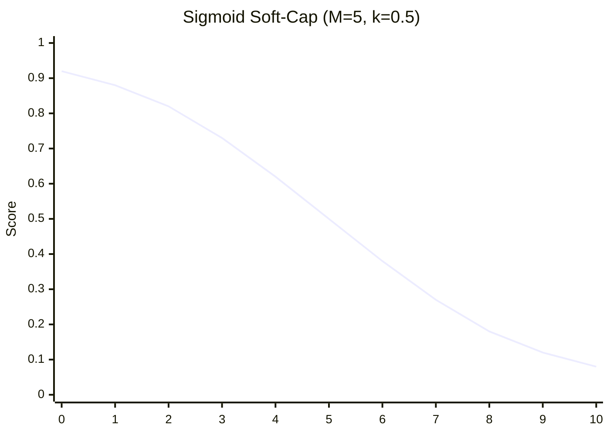
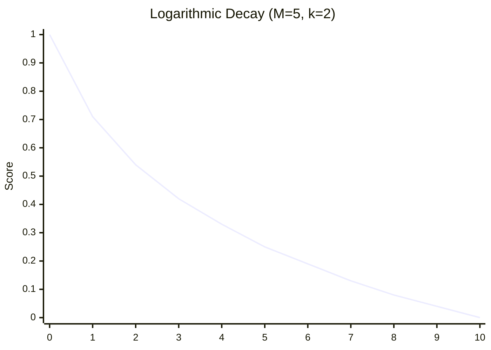
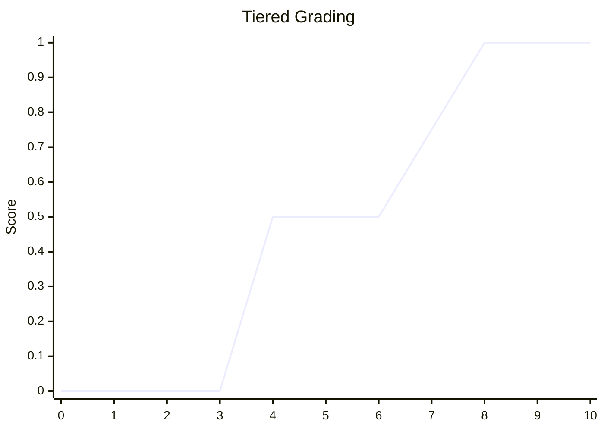
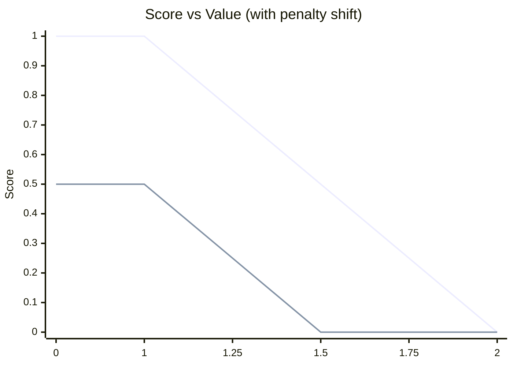

# Scoring

**Scoring strategies** are mathematical approaches used to convert raw metrics into normalized scores
(typically 0-1 range) that provide meaningful feedback about performance against targets or budgets. These
strategies are particularly valuable in software development contexts where you need to track and visualize how
well various metrics (like bundle sizes, test coverage, API latency, or build times) are performing relative to
established thresholds or baselines. Each strategy offers different characteristics - some provide linear
relationships between the metric and score, while others offer more nuanced behaviors like soft caps or
logarithmic scaling.

## Value Scoring Strategies

### Overview Table

| **Strategy Name**     | **Formula**                                                                                                                            | **Description**                                                                |
| --------------------- | -------------------------------------------------------------------------------------------------------------------------------------- | ------------------------------------------------------------------------------ |
| **Percent Used**      | $$\text{score}= \max\!\left(0,\,1 - \frac{S}{M}\right)$$                                                                               | Linearly falls from 1→0 as **S** goes 0→**M**, then clamps at 0.               |
| **Linear Overshoot**  | $$\text{score}= \begin{cases}1,&S\le M\\[4pt]1 - \dfrac{S - M}{M},&S>M\end{cases}$$                                                    | Holds 1 until **S**=**M**, then falls linearly to 0 by **S**=2·**M**.          |
| **Relative Baseline** | $$\text{score}= \mathrm{clamp}_{0..1}\!\Bigl(0.5 + \frac{\text{baseline} - S}{2\,\text{baseline}}\Bigr)$$                              | Centers at 0.5 when **S** matches baseline; >0.5 improvement, <0.5 regression. |
| **Sigmoid Soft-Cap**  | $$\text{score}= \frac{1}{1 + e^{\,k\,(S - M)}}$$                                                                                       | Remains near 1 before **M**, then gently decays, steep after threshold.        |
| **Logarithmic Decay** | $$\text{score}= \max\!\Bigl(0,\,1 - \frac{\log_{10}(1+S)}{\log_{10}(1 + M\,k)}\Bigr)$$                                                 | Penalises large **S** sharply, small overruns have mild impact.                |
| **Tiered Grading**    | $$\text{score}= \begin{cases}1,&P\ge0.9\\[2pt]0.75,&P\ge0.75\\[2pt]0.5,&P\ge0.5\\[2pt]0,&\text{otherwise}\end{cases},\;P=\frac{S}{M}$$ | Maps **S/M** into A/B/C/F bands for clear grade visualization.                 |

---

### Percent Used Details

Directly reflects remaining budget fraction.

**Pros:**

- Intuitive (% headroom).
- Simple to compute.  
  **Cons:**
- Flatlines at 0 once budget is exceeded.

**Implementation:**

```ts
function percentUsed(current: number, max: number): number {
  return Math.max(0, 1 - current / max);
}
```

**When to use it:**  
Ideal for any strict size or time budget (bundle size, build time) where you care about how much headroom remains. Simple dashboards and alerts benefit from a direct “% remaining” metric.

**Examples:**

- **Bundle Stats:** Track JS bundle headroom under a 500 KB limit.
- **Test Coverage:** % lines covered vs 80 % threshold.
- **Page Load (LCP):** Remaining ms under a 2 s budget.

**Chart:**



---

### Linear Overshoot Details

Penalty grows linearly with overshoot.

**Pros:**

- Proportional and predictable.
- Easy to explain to stakeholders.  
  **Cons:**
- Can go negative if not clamped.

**Implementation:**

```ts
function linearOvershoot(current: number, max: number): number {
  if (current <= max) {
    return 1;
  }
  return Math.max(0, 1 - (current - max) / max);
}
```

**When to use it:**  
When you want to maintain proportional visibility into how far a metric has exceeded its limit (e.g., memory usage, API latency). Works well if you clamp at 0 to avoid negatives.

**Examples:**

- **API Latency:** Overshoot above 200 ms threshold.
- **Memory Usage:** RAM above configured max.
- **CSS Sizes:** Style sheets above a 50 KB cap.

**Chart:**

```mermaid
xychart-beta
    title "Linear Overshoot"
    x-axis [0,5,10,12,14,16,18,20]
    y-axis "Score" 0 --> 1
    line Overshoot [1,1,1,0.8,0.6,0.4,0.2,0]
```

---

### Relative Baseline Details

Compares current value to a historical baseline.

**Pros:**

- Symmetric: 0.5 = “no change.”
- Highlights improvements/regressions.  
  **Cons:**
- Requires reliable baseline data.

**Implementation:**

```ts
function relativeBaseline(current: number, baseline: number): number {
  const score = 0.5 + (baseline - current) / (2 * baseline);
  return Math.max(0, Math.min(1, score));
}
```

**When to use it:**  
Perfect for tracking trends across releases (bundle size, test performance, code complexity). Shifts focus from absolute budgets to continuous improvement.

**Examples:**

- **Bundle Stats:** Compare today’s bundle size vs last release.
- **Test Duration:** Measure speedup/regression of test suite.
- **Doc Coverage:** Track improvements in storybook coverage.

**Chart:**



---

### Sigmoid Soft-Cap Details

Soft threshold with tunable steepness.

**Pros:**

- Gentle near the cap; harsh after.
- Never negative or >1.  
  **Cons:**
- Requires selecting a constant **k**.
- Less intuitive without plotting.

**Implementation:**

```ts
function sigmoidSoftCap(current: number, max: number, k: number = 0.5): number {
  return 1 / (1 + Math.exp(k * (current - max)));
}
```

**Parameter Details:**

- **k** (steepness factor): Controls how quickly the score drops after exceeding the threshold
  - `k = 0.1`: Very gentle decline, scores remain high even with significant overshoot
  - `k = 0.5`: Moderate decline (default), balanced between tolerance and penalty
  - `k = 1.0`: Steep decline, harsh penalty for any overshoot
  - `k = 2.0`: Very steep decline, almost binary behavior near the threshold

**When to use it:**  
Use when minor breaches are acceptable but you want strong pressure against large overruns (e.g. accessibility violations, deprecation warnings).

**Examples:**

- **ESLint Errors:** Small numbers of lint errors tolerated.
- **TS Diagnostics:** Minor type mismatches vs critical errors.
- **Security Audits:** Few low-severe alerts OK; many not.

**Chart:**



---

### Logarithmic Decay Details

Log-scale penalty for wide-range data.

**Pros:**

- Highlights massive overruns.
- Small ones barely noticed.  
  **Cons:**
- Formula less intuitive.

**Implementation:**

```ts
function logarithmicDecay(current: number, max: number, k: number = 2): number {
  const score = 1 - Math.log10(1 + current) / Math.log10(1 + max * k);
  return Math.max(0, score);
}
```

**Parameter Details:**

- **k** (scaling factor): Controls the logarithmic compression range
  - `k = 1`: Minimal compression, behaves more like linear decay
  - `k = 2`: Moderate compression (default), good balance for most metrics
  - `k = 5`: Strong compression, very tolerant of small overruns but penalizes large ones
  - `k = 10`: Maximum compression, almost flat until very large overruns

**When to use it:**  
Ideal for metrics spanning orders of magnitude (e.g. network RTT, bundle gzipped vs uncompressed sizes).

**Examples:**

- **CWV (FID):** First Input Delay distribution.
- **Bundle Stats:** Large vs small chunks on log scale.
- **API Throttling:** High‐tail latency events.

**Chart:**



---

### Tiered Grading Details

Discrete grade bands (A/B/C/F).

**Pros:**

- Very readable.
- No continuous math needed for viewers.  
  **Cons:**
- Abrupt jumps hide nuance.

**Implementation:**

```ts
function tieredGrading(current: number, max: number): number {
  const ratio = current / max;
  if (ratio >= 0.9) return 1;
  if (ratio >= 0.75) return 0.75;
  if (ratio >= 0.5) return 0.5;
  return 0;
}
```

**When to use it:**  
Best for executive dashboards or compliance checks where letter‐grade is preferred over percentages.

**Examples:**

- **Test Coverage:** A: ≥90 %, B: 75 – 89 %, C: 50 – 74 %.
- **Doc Coverage:** Storybook or JSDoc rates.
- **Security Score:** CVSS banding.

**Chart:**



## Advanced Scoring Strategies

### Overview Table

| **Strategy Name**         | **Formula**                                                                                                       | **Description**                                                                |
| ------------------------- | ----------------------------------------------------------------------------------------------------------------- | ------------------------------------------------------------------------------ |
| **Issue Penalty Scoring** | $$\text{finalScore} = \max\left(0, \text{thresholdScore} - \frac{w_e \times E + w_w \times W}{w_e + w_w}\right)$$ | Combines threshold limits with diagnostic penalties for comprehensive scoring. |

---

### Issue Penalty Scoring

Combines threshold limits with diagnostic penalties for comprehensive scoring.

**Pros:**

- Combines quantitative limits with quality metrics
- Configurable penalty weights for different issue types
- Applicable to any metric with both thresholds and diagnostics

**Cons:**

- More complex than single-metric strategies
- Requires careful tuning of penalty weights

**Implementation:**

```ts
function issuePenaltyScore(value: number, threshold: number, errors: number, warnings: number, errorWeight: number = 1, warningWeight: number = 0.5): number {
  const thresholdScore = value <= threshold ? 1 : Math.max(0, 1 - (value - threshold) / threshold);
  const penalty = errorWeight * errors + warningWeight * warnings;
  const totalWeight = errorWeight + warningWeight;
  const normalizedPenalty = totalWeight > 0 ? penalty / totalWeight : 0;
  return Math.max(0, thresholdScore - normalizedPenalty);
}
```

**When to use it:**
Ideal for production metrics where you need to balance performance targets with maintainability diagnostics.

**Examples:**
Bundle size + ESLint errors, page load time + accessibility warnings, complexity thresholds + TypeScript diagnostics.

**Parameters & Formulas:**

| Parameter | Description                                     |
| --------- | ----------------------------------------------- |
| `S`       | Actual value (bytes, milliseconds, count, etc.) |
| `M`       | Maximum threshold value                         |
| `E`       | Count of **errors** (🚨)                        |
| `W`       | Count of **warnings** (⚠️)                      |
| `we`      | Weight per error (default 1)                    |
| `ww`      | Weight per warning (default 0.5)                |

##### Size score

$`
\mathrm{sizeScore} =
\begin{cases}
1, & S \le M\\[6pt]
\max\bigl(0,\;1 - \tfrac{S - M}{M}\bigr), & S > M
\end{cases}
`$

##### Issues penalty

$`
\mathrm{penalty} = we \times E \;+\; ww \times W
`$

##### Final blended score

$`
\mathrm{finalScore} = \max\!\Bigl(0,\;\mathrm{sizeScore} - \frac{\mathrm{penalty}}{we + ww}\Bigr)
`$

**Example:** Value=15 (threshold: 10), 1 error, 2 warnings → thresholdScore = 0.5, penalty = 2, finalScore = 0

**Chart:**


