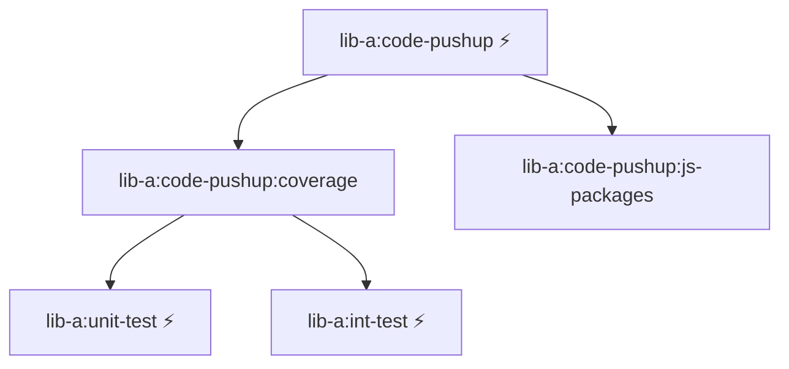

# Caching Example Turborepo

To cache plugin runner output with Turborepo, wire Code Pushup into your turbo.json pipeline and pass Code Pushup flags (`--cache.write`, `--cache.read`, `--onlyPlugins`, `--persist.skipReports`) through task scripts. Turborepo will cache task outputs declared in outputs, and you can target affected packages with `--filter=[origin/main]`.

## `{projectRoot}/code-pushup.config.ts`

```ts
import coveragePlugin from '@code-pushup/coverage-plugin';
import jsPackagesPlugin from '@code-pushup/js-packages-plugin';
import type { CoreConfig } from '@code-pushup/models';

export default {
  plugins: [
    await coveragePlugin({
      reports: ['coverage/lcov.info'],
      coverageTypes: ['function', 'branch', 'line'],
    }),
    await jsPackagesPlugin(),
  ],
  upload: {
    server: 'https://portal.code-pushup.dev/api',
    organization: 'my-org',
    project: 'lib-a',
    apiKey: process.env.CP_API_KEY,
  },
} satisfies CoreConfig;
```

## Root `turbo.json`

```json
{
  "$schema": "https://turbo.build/schema.json",
  "pipeline": {
    "unit-test": {
      "outputs": ["coverage/unit-test/**"]
    },
    "int-test": {
      "outputs": ["coverage/int-test/**"]
    },
    "code-pushup:coverage": {
      "dependsOn": ["unit-test", "int-test"],
      "outputs": [".code-pushup/coverage/**"]
    },
    "code-pushup:js-packages": {
      "outputs": [".code-pushup/js-packages/**"]
    },
    "code-pushup": {
      "dependsOn": ["code-pushup:coverage", "code-pushup:js-packages"],
      "outputs": [".code-pushup/**"]
    }
  }
}
```

## `packages/lib-a/package.json`

```json
{
  "name": "lib-a",
  "scripts": {
    "unit-test": "vitest --config packages/lib-a/vitest.unit.config.ts --coverage",
    "int-test": "vitest --config packages/lib-a/vitest.int.config.ts --coverage",
    "code-pushup:coverage": "code-pushup collect --config packages/lib-a/code-pushup.config.ts --cache.write --persist.skipReports --persist.outputDir packages/lib-a/.code-pushup --onlyPlugins=coverage",
    "code-pushup:js-packages": "code-pushup collect --config packages/lib-a/code-pushup.config.ts --cache.write --persist.skipReports --persist.outputDir packages/lib-a/.code-pushup --onlyPlugins=js-packages",
    "code-pushup": "code-pushup autorun --config packages/lib-a/code-pushup.config.ts --cache.read --persist.outputDir packages/lib-a/.code-pushup"
  }
}
```

> **Note:** `--cache.write` is used on the collect step to persist each plugin's audit-outputs.json; `--cache.read` is used on the autorun step to reuse those outputs.

## Turborepo Task Graph

This configuration creates the following task dependency graph:

**Legend:**

- ⚡ = Cached target (via outputs)



## Command Line Examples

```bash
# Run all affected packages e.g. turbo run code-pushup:coverage --filter=lib-a
turbo run code-pushup:* --filter=[origin/main]

# Run all affected packages and upload the report to the portal
turbo run code-pushup --filter=[origin/main]
```

This approach has the following benefits:

1. **Parallel Execution**: Plugins can run in parallel
2. **Finegrained Caching**: Code level cache invalidation enables usage of affected packages filtering
3. **Dependency Management**: Leverage Turborepo task dependencies and its caching strategy
4. **Clear Separation**: Each plugin has its own target for better debugging and maintainability
