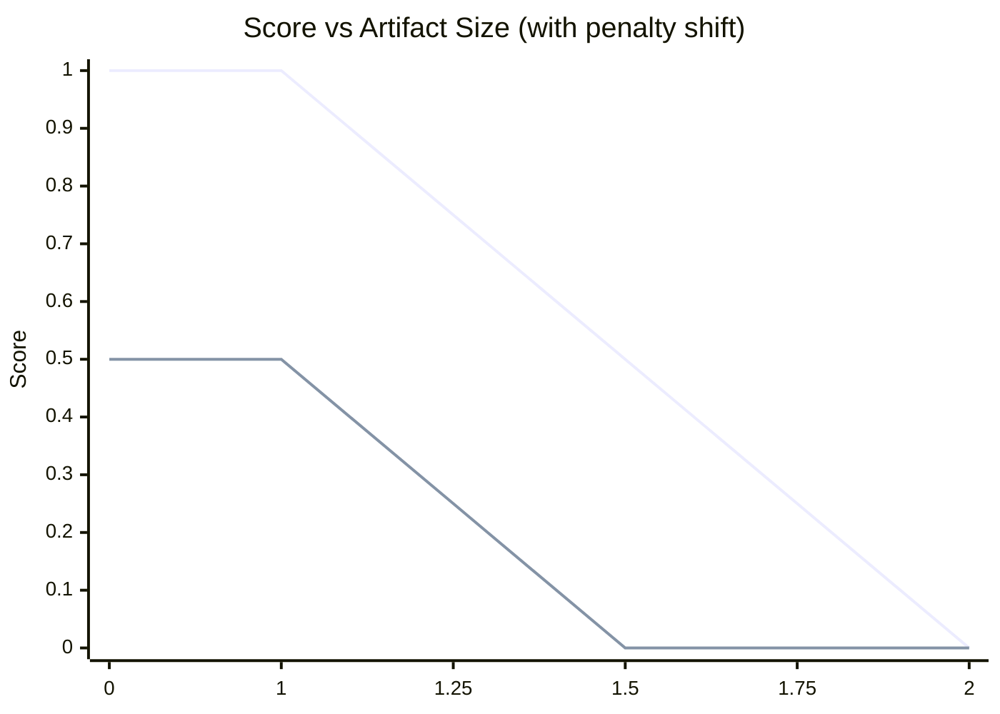

# @code-pushup/bundle-stats-plugin

[](https://www.npmjs.com/package/@code-pushup/bundle-stats-plugin)
[](https://npmtrends.com/@code-pushup/bundle-stats-plugin)
[](https://www.npmjs.com/package/@code-pushup/bundle-stats-plugin?activeTab=dependencies)

🕵️ **Code PushUp plugin for measuring bundle size with diagnostics.** 🔥

---

This plugin analyzes your build output from modern bundlers to provide detailed bundle size insights and help you track bundle optimization over time. It supports multiple bundlers and provides configurable thresholds for monitoring bundle size targets.

Bundle statistics are mapped to Code PushUp audits in the following way:

- **Value**: Total bundle size in bytes for the analyzed configuration
- **Score**: Calculated based on size thresholds with penalties for oversized artifacts
- **Display Value**: Human-readable bundle size (e.g., "2.5 MB")
- **Issues**: Detailed warnings and errors for bundles exceeding thresholds
- **Tree View**: Interactive breakdown of bundle contents showing files, chunks, and imports

## Getting started

1. If you haven't already, install [@code-pushup/cli](../cli/README.md) and create a configuration file.

2. Install as a dev dependency with your package manager:

   ```sh
   npm install --save-dev @code-pushup/bundle-stats-plugin
   ```

   ```sh
   yarn add --dev @code-pushup/bundle-stats-plugin
   ```

   ```sh
   pnpm add --save-dev @code-pushup/bundle-stats-plugin
   ```

3. Set up your bundler to generate statistics files. The plugin currently supports:

   <details>
   <summary><strong>ESBuild</strong> (recommended)</summary>

   ```bash
   esbuild src/index.js --bundle --outfile=dist/bundle.js --metafile=dist/stats.json
   ```

   </details>

   <details>
   <summary><strong>Webpack</strong></summary>

   ```js
   // webpack.config.js
   module.exports = {
     // ... your config
     plugins: [
       new (require('webpack').StatsWriterPlugin)({
         filename: 'stats.json',
       }),
     ],
   };
   ```

   </details>

   <details>
   <summary><strong>Vite</strong> (via Rollup)</summary>

   ```js
   // vite.config.js
   export default {
     build: {
       rollupOptions: {
         plugins: [
           {
             name: 'bundle-stats',
             generateBundle() {
               this.emitFile({
                 type: 'asset',
                 fileName: 'stats.json',
                 source: JSON.stringify(this.getModuleInfo()),
               });
             },
           },
         ],
       },
     },
   };
   ```

   </details>

4. Add this plugin to the `plugins` array in your Code PushUp CLI config file (e.g. `code-pushup.config.ts`).

   ```ts
   import bundleStatsPlugin from '@code-pushup/bundle-stats-plugin';

   export default {
     // ...
     plugins: [
       // ...
       await bundleStatsPlugin({
         artefact: 'dist/stats.json',
         bundler: 'esbuild',
         configs: [
           {
             title: 'Main Bundle',
             include: ['main-*.js', 'polyfills-*.js'],
             thresholds: {
               totalSize: [300 * 1024, 1024 * 1024], // 300KB - 1MB
               artefactSize: 500 * 1024, // 500KB max per file
             },
           },
           {
             title: 'Lazy Chunks',
             include: ['**/chunk-*.js'],
             thresholds: {
               totalSize: [10 * 1024, 100 * 1024], // 10KB - 100KB
             },
           },
         ],
       }),
     ],
   };
   ```

5. <details>
   <summary><strong>(Optional) Generate bundle stats automatically before analysis</strong></summary>

   ```ts
   await bundleStatsPlugin({
     generateArtefacts: {
       command: 'npm',
       args: ['run', 'build:stats'],
       cwd: './path/to/your/project',
     },
     artefact: 'dist/stats.json',
     bundler: 'esbuild',
     configs: [
       /* ... */
     ],
   });
   ```

   </details>

6. Run the CLI with `npx code-pushup collect` and view or upload report (refer to [CLI docs](../cli/README.md)).

## About bundle analysis

Bundle analysis helps you understand the composition and size of your application bundles. This plugin provides insights into:

- **Bundle Size Tracking**: Monitor total bundle sizes against configurable thresholds
- **File-by-File Breakdown**: See exactly which files contribute to bundle size
- **Chunk Analysis**: Understand code splitting effectiveness
- **Dependency Insights**: Identify heavy dependencies and opportunities for optimization
- **Threshold Monitoring**: Set size budgets for different bundle types (main, vendor, lazy chunks)

The plugin organizes bundles into logical groups and provides detailed tree views showing:

- Entry files (main.js, polyfills.js)
- Lazy-loaded chunks
- Third-party dependencies
- Source files and their relative contributions

## Plugin architecture

<details>
<summary><strong>Plugin configuration specification</strong></summary>

The plugin accepts the following parameters:

#### Required Parameters

- **`artefact`**: Path to the bundler statistics file (JSON)
- **`bundler`**: Type of bundler used ('esbuild', 'webpack', 'vite', or 'rsbuild')
- **`configs`**: Array of bundle analysis configurations

#### Bundle Configuration Options

Each configuration in the `configs` array supports:

- **`title`**: Human-readable name for the bundle analysis
- **`include`**: Glob patterns for files to include in analysis (e.g., `['main-*.js', '*.css']`)
- **`exclude`**: Glob patterns for files to exclude (optional)
- **`thresholds`**: Size thresholds for scoring
  - **`totalSize`**: Total bundle size threshold as number or `[min, max]` tuple
  - **`artefactSize`**: Individual file size threshold (optional)

#### Optional Parameters

- **`generateArtefacts`**: Command to run before analysis to generate stats files

  - **`command`**: Command to execute (e.g., 'npm', 'npx')
  - **`args`**: Array of command arguments
  - **`cwd`**: Working directory for command execution

- **`grouping`**: Options for organizing bundle contents (uses defaults)
- **`pruning`**: Tree display options
  - **`maxChildren`**: Maximum child nodes to show (default: 10)
  - **`maxDepth`**: Maximum tree depth (default: 2)
  - **`startDepth`**: Starting depth for analysis (default: 0)

</details>

<details>
<summary><strong>Bundle threshold configuration</strong></summary>

Thresholds can be specified as:

1. **Single number**: Maximum allowed size

   ```ts
   thresholds: {
     totalSize: 1024 * 1024, // 1MB max
     artefactSize: 500 * 1024, // 500KB max per file
   }
   ```

2. **Range tuple**: `[minimum, maximum]` sizes
   ```ts
   thresholds: {
     totalSize: [300 * 1024, 1024 * 1024], // 300KB - 1MB range
   }
   ```

</details>

### Audits

A audit encapsulates a group of artefacts determined by `BundleStatsConfig`.

#### Scoring

The plugin assigns a **score** in the range `[0 … 1]` to each artefact (or artefact group) based on its byte size relative to a configurable **maximum threshold** (`maxArtefactSize`). A perfect score (`1`) means "within budget," and a zero score (`0`) means "critically over budget."

##### Scoring Parameters

| **Parameter** | **Description**                     |
| ------------: | ----------------------------------- |
|           `S` | Actual bytes                        |
|           `M` | Size threshold bytes                |
|           `E` | Number of "Too Large" (🚨) errors   |
|           `W` | Number of "Too Small" (⚠️) warnings |
|          `we` | Weight per error (default 1)        |
|          `ww` | Weight per warning (default 0.5)    |

###### Size score

$`
\mathrm{sizeScore} =
\begin{cases}
1, & S \le M\\[6pt]
\max\bigl(0,\;1 - \tfrac{S - M}{M}\bigr), & S > M
\end{cases}
`$

###### Issues penalty

$`penalty = we * E + ww * W`$

###### Final blended score

$`
\mathrm{finalScore} = \max\!\Bigl(0,\;\mathrm{sizeScore} - \frac{\mathrm{penalty}}{we + ww}\Bigr)
`$



#### Issues

The plugin optionally creates diagnostic for the given artefacts.
The following table shows all different options:

| Diagnostic   | Description                                                                                              | Config Key      | Default         | Severity | Recommended Action                                                      |
| ------------ | -------------------------------------------------------------------------------------------------------- | --------------- | --------------- | -------- | ----------------------------------------------------------------------- | -------------------------------------------------------------------- |
| Too Large 🚨 | Artifact exceeds the maximum allowed size. May indicate an unoptimized bundle or accidentally checked-in | binary.         | maxArtifactSize | 5 MB     | Error                                                                   | Review and optimize the artifact (e.g. code splitting, compression). |
| Too Small ⚠️ | Artifact is below the minimum expected size. Could signal missing dependencies or incomplete build.      | minArtifactSize | 1 KB            | Warn     | Verify that the build output is complete and dependencies are included. |

**Example Issues:**

|   Severity   | Message                                                                        |      Source file      | Line(s) |
| :----------: | :----------------------------------------------------------------------------- | :-------------------: | :-----: |
|  🚨 _error_  | `main.js` is 6.12 MB (max 5 MB); enable code-splitting or lazy-loading.        |  `dist/lib/main.js`   |         |
|  🚨 _error_  | `vendor.js` is 2.05 MB (max 1.5 MB); apply tree-shaking or serve libs via CDN. | `dist/lib/vendor.js`  |         |
| ⚠️ _warning_ | `utils.js` is 50 kB (min 100 kB); verify bundling.                             |  `dist/lib/utils.js`  |         |
| ⚠️ _warning_ | `styles.css` is 10 B (min 1 kB); check CSS inclusion.                          | `dist/lib/styles.css` |         |

#### Artefact Tree

**Example:**

```txt
🗂️ example-group                         237.17 kB   101 files
├── 📍 entry-1.js                         138 kB    2 files
│   ├── 📄 src/input-1.ts                 101 kB
│   └── 📄 src/input-2.ts                  37 kB
├── 📄 entry-2.js                             30 kB 2 files
│   ├── 📄 node_modules/@angular/router/provider.js
│   └── 📄 node_modules/@angular/router/service.js
├── 🎨 styles.css                             14 kB
└── 🔗 static imports from 📍 entry-1.js     104 kB
    └── 📄 file-1.js

```

#### Artefact Types

Each group is also displayed as tree of artefacts, inputs and static imports.
The following types are detected.

- 📄 - script file - JS/TS artefact
- 🎨 - style files - CSS/SCSS artefacts
- 📍 - entry file - JS/TS artefact
- 🔗 - static imports - List of S/TS artefacts statically imported by another file

```txt
🗂️ example-group                             190 kB  4 files
├── 📍 entry-1.js                            100 kB   2 files
├── 📄 file-1.js                                 30 kB   2 files
├── 🎨 styles.css                             10 kB
└── 🔗 static imports from 📍 entry-1.js
    └── 📄 file-2.js                            50 kB

```

#### Artefact Inputs

Each artefact is maintains out of inputs ind imports. The inputs are listed under each chunk.

```txt
🗂️ example-group                              60 kB  1 files
└── 📄 file-1.js                                60 kB  3 files
    ├── 📄 src/lib/cli.js
    │    └── 📄 node_modules/yargs/yargs.js
    └── 📄 node_modules/zod/helpers
        └── 📄 node_modules/zod/helpers/description.js
```

#### Artefact Imports

Each artefact imports that are statically imported and directly contribute to the artefact group size are listed under dedicated import groups per file. This is helpful to understand the true size of you artefact group.
Static imports are loaded together with it's importing parent and therefore will end up in the loaded bytes. Displaying them helps to inderstand why they are part and where they aer imported from.

```txt
🗂️ example-group                                           150 kB  6 files
├── 📍 entry-1.js                                          100 kB
├── 📄 file-1.js                                               50 kB
├── 🔗 static imports from 📍 entry-1.js     60 kB  2 files
│    ├── 📄 file-2.js                                         40 kB
│    └── 📄 file-3.js                                        40 kB
└── 🔗 static imports from 📄 file-1.js        80 kB  2 files
    ├── 📄 file-4.js                                          40 kB
    └── 📄 file-5.js                                         40 kB

```

#### Artefact Grouping

Artefact inputs can be grouped over the configuration.

**Ungrouped:**

```txt
🗂️ example-group                             150 kB  1 files
└── 📄 entry-2.js                            150 kB  3 files
    ├── 📄 node_modules/@angular/router/provider.js
    └── 📄 node_modules/@angular/router/service.js
        └── 📄 node_modules/@angular/router/utils.js
```

**Grouped by:**

- `patterns` - `node_modules/@angular/router`
- `name` - `@angular/router`
- `icon` - "🅰️"
- `depth` - `1`

```txt
🗂️ example-group                             150 kB  1 files
└── 📄 entry-2.js                           150 kB  1 files
    └─  🅰️ @angular/router

```

#### Tree Pruning

The artefact tree can get quite dense in information. To avoid overload we reduce the amount of visible nodes.

**Unpruned:**

```txt
🗂️ example-group                           800 kB   10 files
├── 📍 index.js                             250 kB    4 files
│   ├── 📄 src/app.js                       120 kB    3 files
│   │   ├── 📄 src/components/Header.js      40 kB    2 files
│   │   │   ├── 📄 src/components/Logo.js     15 kB    1 file
│   │   │   └── 📄 src/components/Nav.js      25 kB    1 file
│   │   └── 📄 src/utils/math.js             30 kB    1 file
│   ├── 📄 src/route-1.js                     120 kB    3 files
│   ├── 📄 src/route-2.js                     120 kB    3 files
│   └── 📄 src/main.css                       50 kB    1 file
├── 📄 vendor.js                             300 kB    5 files
│   ├── 📄 node_modules/react.js             100 kB    1 file
│   ├── 📄 node_modules/react-dom.js          80 kB    1 file
│   ├── 📄 node_modules/redux.js              60 kB    1 file
│   ├── 📄 node_modules/react-router.js       40 kB    1 file
│   └── 📄 node_modules/lodash.js             20 kB    1 file
└── 📄 logo.svg                              250 kB    1 file

```

**Pruning options:**

- `startDepth` - `1`
- `maxChildren` - `1`
- `maxDepth` - `3`

**Pruned:**

```txt
🗂️ example-group                             150 kB  10 files
├── 📍 index.js                             250 kB    4 files
│   ├── 📄 src/app.js                       120 kB
│   └── … 3 more inputs                    130 kB
├── 📄 vendor.js                             300 kB    5 files
│   ├── 📄 node_modules/react.js             100 kB
│   └── … 4 more inputs                            200 kB
└── 📄 logo.svg                              250 kB
```

<details>
<summary><strong>Audits and bundle organization</strong></summary>

Each configuration creates a separate audit with:

```ts
{
  slug: 'main-bundle', // Generated from title
  title: 'Main Bundle (4 files)',
  score: 0.85,
  value: 1048576, // Total bytes
  displayValue: '1 MB',
  details: {
    issues: [/* Size threshold violations */],
    trees: [/* Interactive bundle breakdown */]
  }
}
```

</details>

### Optionally set up categories

Reference audits which you wish to include in custom categories:

```ts
export default {
  // ...
  categories: [
    {
      slug: 'bundle-size',
      title: 'Bundle Size',
      refs: [
        {
          type: 'audit',
          plugin: 'bundle-stats',
          slug: 'main-bundle',
          weight: 3,
        },
        {
          type: 'audit',
          plugin: 'bundle-stats',
          slug: 'lazy-chunks',
          weight: 1,
        },
      ],
    },
  ],
};
```

## Supported bundlers

| Bundler     | Status          | Stats Generation             |
| ----------- | --------------- | ---------------------------- |
| **ESBuild** | ✅ Full support | `--metafile=stats.json`      |
| **Webpack** | 🚧 Partial      | Custom stats plugin required |
| **Vite**    | 🚧 Planned      | Via Rollup plugin            |
| **RSBuild** | 🚧 Planned      | Native stats output          |

> **Note**: Currently, ESBuild is the most thoroughly tested and recommended bundler for this plugin.
