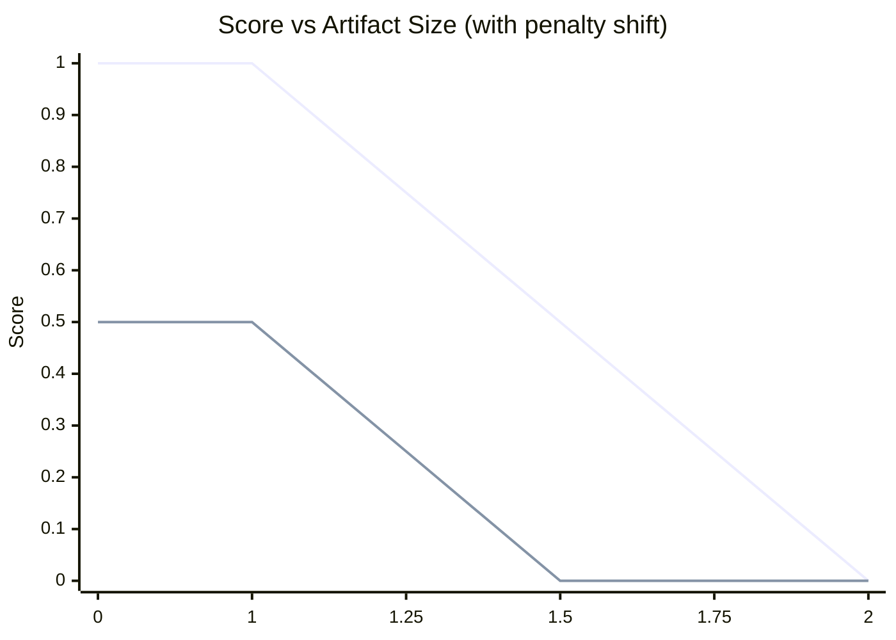

# Plugin Features

## Table of Contents

- **[Metric](#metric)**
- **[Artefacts](#artefacts)**
  - [Bundle Stats](#bundle-stats)
- **[Features](#features)**
  - [General](#general)
  - [Selection](#selection)
    - [Type Definitions](#type-definitions)
    - [Selection Behaviour](#selection-behaviour)
      - [Include Specific Output](#include-specific-output)
    - [Include by Input Files](#include-by-input-files)
    - [Include by Entry Point](#include-by-entry-point)
    - [Exclude Outputs Patterns](#exclude-outputs-patterns)
    - [Exclude Inputs Patterns](#exclude-inputs-patterns)
    - [Exclude Entry Points Patterns](#exclude-entry-points-patterns)
  - [Scoring](#scoring)
    - [Total Size Budgets](#total-size-budgets)
    - [Panelties](#panelties)
    - [Scoring Parameters](#scoring-parameters)
      - [Size score](#size-score)
      - [Issues penalty](#issues-penalty)
      - [Final blended score](#final-blended-score)
  - [Issues](#issues)
    - [Too Large Issues](#too-large-issues)
    - [Too Small Issues](#too-small-issues)
    - [Blacklisted Issues](#blacklisted-issues)
  - [Artefact Tree](#artefact-tree)
    - [Artefact Types](#artefact-types)
    - [Artefact Inputs](#artefact-inputs)
    - [Artefact Imports](#artefact-imports)
    - [Artefact Grouping](#artefact-grouping)
    - [Tree Pruning](#tree-pruning)
    - [Formatting](#formatting)
      - [Size Formatting](#size-formatting)
      - [Files Pluralization](#files-pluralization)
      - [Path Shortening](#path-shortening)
      - [Redundant Information Handling](#redundant-information-handling)
  - [Insights Table](#insights-table)

## Metric

**Bundle size** in bytes.
Parsed from `--stats-json` output and grouped by file.

| **Property**     |            **Value** | **Description**                     |
| ---------------- | -------------------: | ----------------------------------- |
| **value**        |             `132341` | Total size of all chunks.           |
| **displayValue** | `13.4 MB / 13 Files` | Display value inc. number of files. |

## Artefacts

@TODO

### Bundle Stats

The following is a minimal stats representation used to explain different features of the plugin. It will be referred to as **Example Stats**.

```
stats.json
└── outputs
    ├── dist/index.js                                    // entryPoint: src/index.ts
    │   ├── inputs
    │   │   └── src/index.ts
    │   │       ├── src/lib/feature-1.ts                // import-statement
    │   │       │   └── src/lib/utils/format.ts         // import-statement
    │   │       ├── src/lib/utils/math.ts               // import-statement
    │   │       └── src/lib/feature-2.ts                // dynamic-import
    │   └── imports
    │       ├── dist/chunks/chunk-U6O5K65G.js           // import-statement
    │       └── dist/chunks/feature-2-X2YVDBQK.js       // dynamic-import
    ├── dist/bin.js                                      // entryPoint: src/bin.ts
    │   ├── inputs
    │   │   └── src/bin.ts
    │   │       ├── src/lib/feature-1.ts                // import-statement
    │   │       │   └── src/lib/utils/format.ts         // import-statement
    │   │       └── src/lib/utils/math.ts               // import-statement
    │   └── imports
    │       └── dist/chunks/chunk-U6O5K65G.js           // import-statement
    ├── dist/chunks/chunk-U6O5K65G.js
    │   └── inputs
    │       ├── src/lib/utils/format.ts
    │       ├── src/lib/feature-1.ts
    │       └── src/lib/utils/math.ts
    └── dist/chunks/feature-2-X2YVDBQK.js               // entryPoint: src/lib/feature-2.ts
        └── inputs
            └── src/lib/feature-2.ts
```

## Features

@TODO

### General

The audit name is provided over the `title` property. Internally a audit `slug` is derived from the

- **`title`**: A unique identifier for this group.
- **`description`**: One two sentences explaining the purpose of the audit

**Types**

```ts
type Audit = {
  slug?: string;
  title: string;
  description?: string;
};
```

**Example Configuration**

```ts
const audit1: Audit = {
  title: 'Initial Bundles',
};

const audit2: Audit = {
  slug: 'app-core',
  title: '🎯 App Core',
  description: 'This audit checks the core functionality of the app.',
};
```

Every audit gets the merged configuration of the global and audit specific configuration listed in the description.

**Configuration Example**

```ts
const config: BundleStatsConfig = {
  title: 'Initial Bundles',
  description: 'This audit checks the initial bundles of the app.',
};
```

**Report Output**

```txt
This audit checks the initial bundles of the app.
<details>
<summary>⚙️ Config Summary</summary>

**Selection**
• `includeOutputs`: `**/*`

**Scoring**
• `totalSize`: `0 B – 97.66 kB`

**Insights**
• 🔧 `**/math.ts`
• 🔧 `**/format.ts`
• 🧩 `**/*feature-2*`
• 🏁 `src/index.ts, src/bin.ts`
• 🤝 `dist/chunks/chunk-*.js`
• 📦 `**/node_modules/**`
• 📦 `dist/index.js, dist/bin.js`

</details>
```

### Selection

To select files for an audit, glob patterns are used to include and exclude parts of the output files.
All options are provided as glob patterns matching either `path`, `path` in `inputs` or `entryPoint`.

**Types**

```ts
export interface SelectionOptions {
  // targeting output path of a `OutputNode`
  includeOutputs: string[];
  excludeOutputs: string[];

  // targeting input paths of a `OutputNode`
  includeInputs: string[];
  excludeInputs: string[];

  // targeting entryPoint path of a `OutputNode`
  includeEntryPoints: string[];
  excludeEntryPoints: string[];
}
```

**Example Configuration**

```ts
const selection: SelectionOptions = {
  includeOutputs: ['**/features/*'],
  excludeOutputs: ['**/features/legacy/**'],
  excludeInputs: ['**/ui/**'],
  includeEntryPoints: ['**/features/auth/*.ts'],
};
```

#### Selection Behaviour

- **Include patterns**: If any include pattern is specified, only matching items are selected
- **Exclude patterns**: Applied after include patterns to filter out unwanted items
- **Pattern matching**: Uses standard glob patterns (`*`, `**`, `?`, `[...]`)
- **Multiple patterns**: All patterns in an array are combined with OR logic
- **Precedence**: Exclude patterns take precedence over include patterns

**🔗 Dependency Preservation**

Excluded files that are **static imports** (`import-statement`) cannot be fully excluded because they:

- **Contribute to bundle size**: They are bundled with their importing file
- **Are always loaded**: They load immediately when their importing file loads
- **Are required dependencies**: Removing them would break the importing file

**Example**: When excluding chunk files:

```ts
{
  includeOutputs: ["**/*"],
  excludeOutputs: ["**/chunks/**"]  // Exclude chunk files
}
```

Static imports will still appear in the `outputs` section:

```txt
outputs
├── dist/index.js
│   └── imports
│       ├── dist/chunks/chunk-U6O5K65G.js               // import-statement
│       └── dist/chunks/feature-2-X2YVDBQK.js           // dynamic-import
└── 🔗 dist/chunks/chunk-U6O5K65G.js                    // preserved as import-statement of dist/index.js
```

**Import Type Behaviour**:

- **`import-statement`**: Always included (static imports are bundled dependencies)
- **`dynamic-import`**: Excluded from selection as they do not contribute to the bundle size (runtime dependencies are required for functionality, but can load separately from the rest)
- **Chunks in outputs**: Can be excluded if not imported by included files

This ensures the selection maintains **functional integrity** while respecting your filtering preferences.

---

> All examples target the stats data under the [Example Stats](#Example-Stats) section above.

---

##### Include Specific Output

**Selection Options**

Select only `dist/index.js` and its dependencies:

```ts
{
  includeOutputs: ['**/dist/index.js'];
}
```

**Selection Result:**

```
stats.json
└── outputs
    ├── 🎯 dist/index.js                                    // entryPoint: src/index.ts
    │   ├── inputs
    │   └── imports
    │       └── dist/chunks/chunk-U6O5K65G.js               // import-statement
    └── 🔗 dist/chunks/chunk-U6O5K65G.js                    // imported by `dist/index.js`
        └── inputs
```

#### Include by Input Files

**Selection Options**

Select outputs that contain specific input files:

```ts
{
  includeInputs: ['**/feature-2.ts'];
}
```

**Selection Result:**

```
stats.json
└── outputs
    ├── dist/index.js                                    // entryPoint: src/index.ts
    │   └── inputs
    │       └── src/index.ts
    │           └── 🎯 src/lib/feature-2.ts               // dynamic-import
    └── 🔗 dist/chunks/chunk-U6O5K65G.js                  // imported by `dist/index.js`
```

#### Include by Entry Point

**Selection Options**

Select outputs that have `src/bin.ts` as their entry point:

```ts
{
  includeEntryPoints: ['**/bin.ts'];
}
```

**Selection Result:**

```
stats.json
└── outputs
    ├── dist/bin.js                                     // entryPoint: src/bin.ts 🎯
    └── 🔗 dist/chunks/chunk-U6O5K65G.js                // imported by `dist/bin.js`
```

#### Exclude Outputs Patterns

**Selection Options**

Select all outputs except bin files:

```ts
{
  includeOutputs: ["**/*"],
  excludeOutputs: ["**/bin.js"]
}
```

**Selection Result:**

```
stats.json
└── outputs
    ├── 🎯 dist/index.js                                    // entryPoint: src/index.ts
    ├── 🔗 dist/chunks/chunk-U6O5K65G.js                    // imported by `dist/index.js`
    ├── 🔗 dist/chunks/feature-2-X2YVDBQK.js               // imported by `dist/index.js`
    └── // excluded: dist/bin.js
```

#### Exclude Inputs Patterns

**Selection Options**

Select all outputs but exclude those containing feature-2 files:

```ts
{
  includeOutputs: ["**/*"],
  excludeInputs: ["**/feature-2.ts"]
}
```

**Selection Result:**

```
stats.json
└── outputs
    ├── 🎯 dist/bin.js                                      // entryPoint: src/bin.ts
    ├── 🔗 dist/chunks/chunk-U6O5K65G.js                    // imported by `dist/bin.js`
    ├── // excluded: dist/index.js (contains feature-2.ts)
    └── // excluded: dist/chunks/feature-2-X2YVDBQK.js (contains feature-2.ts)
```

#### Exclude Entry Points Patterns

**Selection Options**

Select all outputs except those with bin entry points:

```ts
{
  includeOutputs: ["**/*"],
  excludeEntryPoints: ["**/bin.ts"]
}
```

**Selection Result:**

```
stats.json
└── outputs
    ├── 🎯 dist/index.js                                    // entryPoint: src/index.ts
    ├── 🔗 dist/chunks/chunk-U6O5K65G.js                    // imported by `dist/index.js`
    ├── 🔗 dist/chunks/feature-2-X2YVDBQK.js               // imported by `dist/index.js`
    └── // excluded: dist/bin.js (entryPoint: src/bin.ts)
```

### Scoring

The plugin assigns a **score** in the range `[0 … 1]` to each artefact (or artefact selection) based on:

1. **Size** vs. a configurable maximum threshold
2. **Diagnostics penalties** (errors & warnings, including blacklist violations as warnings)

A perfect score (`1`) means “within budget”; lower values indicate regressions.

The selection process of a scored set of files is explained in detail in [File Selection](#File-Selection)

**Types**

```ts

export interface ScoringOptions {
  // targeting output path of a `OutputNode`
  totalSize: number | MinMax;
  penalty: {
    artefactSize?: number | MinMax;
    blacklist?: string[];
  }
```

**Example Configuration**

```ts
const selection: SelectionOptions = {
  includeOutputs: ['**/features/*'],
  excludeOutputs: ['**/features/legacy/**'],
  excludeInputs: ['**/ui/**'],
  includeEntryPoints: ['**/features/auth/*.ts'],
};
```

#### Total Size

Every artefact selection has budgets assigned under `budget`.

- **`totalSize`**: Total bytes of all files in a selection.

**Examples**

```ts
const scoring1: Scoring = {
  totalSize: 300_000,
};

const scoring2: Scoring = {
  totalSize: [10_000, 300_000],
};
```

#### Panelties

To give actionable feedback to users of the plugin you can add penalties a set of penalties:

- **`artefactSize`**: Byte size of a files in a selection.
- **`blacklist`**: List of globs to flag inputs as well as imports as forbidden

**Types**

```ts
type Penalty = {
  artefactSize?: number | MinMax;
  blacklist?: string[];
};
```

**Example Configuration**

```ts
const penalty1: Penalty = {
  artefactSize: 50_000,
};

const penalty2: Penalty = {
  artefactSize: [1_000, 50_000],
  blacklist: ['node_modules/old-charting-lib'],
};
```

#### Scoring Parameters

| **Parameter** | **Description**                                                        |
| ------------: | ---------------------------------------------------------------------- |
|           `S` | Actual bytes                                                           |
|           `M` | Size threshold bytes                                                   |
|           `E` | Count of issues of severity errors (🚨)                                |
|           `W` | Count of issues of severity warnings (⚠️), including blacklist matches |
|          `we` | Weight per error (default `1`)                                         |
|          `ww` | Weight per warning (default `0.5`)                                     |

##### Size score

$`
\mathrm{sizeScore} =
\begin{cases}
1, & S \le M\\[6pt]
\max\bigl(0,\;1 - \tfrac{S - M}{M}\bigr), & S > M
\end{cases}
`$

##### Issues penalty

$`
\mathrm{penalty} = we \times E \;+\; ww \times W
`$

##### Final blended score

$`
\mathrm{finalScore} = \max\!\Bigl(0,\;\mathrm{sizeScore} - \frac{\mathrm{penalty}}{we + ww}\Bigr)
`$



### Issues

To give users actionable feedback we need to be able to tell _WHAT_ happened, _WHEN_ to fix it and _HOW_ to fix it.

Issues are configured per audit under the `scoring.penalty` property.
The plugin creates **diagnostics** for each penalty. The table below shows all diagnostic types:

| Diagnostic      | Description                                                                                           | Config Key        | Default | Severity | Recommended Action                                                      |
| --------------- | ----------------------------------------------------------------------------------------------------- | ----------------- | ------- | -------- | ----------------------------------------------------------------------- |
| **Blacklisted** | Artifact contains an import matching a forbidden glob pattern.                                        | `blacklist`       | —       | 🚨 Error | Remove or replace the forbidden dependency.                             |
| **Too Large**   | Artifact exceeds the maximum allowed size. May indicate an unoptimized bundle or accidental check-in. | `maxArtifactSize` | `5 MB`  | 🚨 Error | Review and optimize (e.g. code splitting, compression).                 |
| **Too Small**   | Artifact is below the minimum expected size. Could signal missing dependencies or incomplete build.   | `minArtifactSize` | `1 KB`  | ⚠️ Warn  | Verify that the build output is complete and dependencies are included. |

#### Too Large Issues

Artifacts that exceed the maximum allowed size threshold. This typically indicates unoptimized bundles, accidental inclusion of large files, or missing code splitting strategies.

**Configuration**: `scoring.artifactSize`

**Example Issues:**

| Severity | Message                                                                                         | Source file          | Location |
| -------- | ----------------------------------------------------------------------------------------------- | -------------------- | -------- |
| 🚨 error | `main.js` is **6.12 MB** (exceeds 5 MB); consider splitting or compressing this bundle.         | `dist/lib/main.js`   |          |
| 🚨 error | `vendor.js` is **2.05 MB** (exceeds 1.5 MB); apply tree-shaking or extract shared dependencies. | `dist/lib/vendor.js` |          |

**Use Cases**:

- **Code Splitting**: Break large bundles into smaller chunks
- **Tree Shaking**: Remove unused code from dependencies
- **Compression**: Enable gzip/brotli compression
- **Asset Optimization**: Optimize images and other assets
- **Lazy Loading**: Load code only when needed

#### Too Small Issues

Artifacts that fall below the minimum expected size threshold. This could signal missing dependencies, incomplete builds, or configuration issues.

**Configuration**: `scoring.artifactSize`

**Example Issues:**

| Severity   | Message                                                                                  | Source file           | Location |
| ---------- | ---------------------------------------------------------------------------------------- | --------------------- | -------- |
| ⚠️ warning | `utils.js` is **50 kB** (below 100 kB); confirm that expected dependencies are included. | `dist/lib/utils.js`   |          |
| ⚠️ warning | `styles.css` is **10 B** (below 1 kB); confirm that expected dependencies are included.  | `dist/lib/styles.css` |          |

**Use Cases**:

- **Dependency Check**: Verify all required dependencies are included
- **Build Verification**: Ensure the build process completed successfully
- **Configuration Review**: Check bundler configuration for missing entries
- **Source Validation**: Confirm source files contain expected content

#### Blacklisted Issues

Artifacts containing imports that match forbidden glob patterns. This helps enforce dependency policies and prevent usage of deprecated or unsafe libraries.

**Configuration**: `scoring.blacklist`

**Example Issues:**

| Severity | Message                                                                                                  | Source file           | Location |
| -------- | -------------------------------------------------------------------------------------------------------- | --------------------- | -------- |
| 🚨 error | `node_modules/old-charting-lib/index.js` matches a blacklist pattern; remove or replace this dependency. | `src/main-ASDFGAH.js` |          |

**Use Cases**:

- **Dependency Replacement**: Replace blacklisted libraries with approved alternatives
- **Code Refactoring**: Remove usage of forbidden dependencies
- **Policy Review**: Update dependency policies if needed
- **Security Audit**: Investigate security implications of blacklisted dependencies

### Artefact Tree

**Complete Example:**

```txt
🗂️ example-group                                 237.17 kB   101 files
├── 📍 entry-1.js                                   138 kB    2 files
│   ├── 📄 src/input-1.ts                           101 kB
│   └── 📄 src/input-2.ts                            37 kB
├── 📄 entry-2.js                                    30 kB   2 files
│   ├── 📄 node_modules/@angular/router/provider.js  15 kB
│   └── 📄 node_modules/@angular/router/service.js   15 kB
├── 🎨 styles.css                                    14 kB
└── 🔗 static imports from 📍 entry-1.js            104 kB
    └── 📄 file-1.js

```

#### Artefact Types

Each group is also displayed as tree of artefacts, inputs and static imports.
The following types are detected.

- 📄 - script file - JS/TS artefact
- 🎨 - style files - CSS/SCSS artefacts
- 📍 - entry file - JS/TS artefact
- 🔗 - static imports - List of S/TS artefacts statically imported by another file

```txt
🗂️ example-group
├── 📍 entry-1.js
├── 📄 file-1.js
├── 🎨 styles.css
└── 🔗 static imports from 📍 entry-1.js
    └── 📄 file-2.js

```

#### Artefact Inputs

Each artefact is maintains out of inputs ind imports. The inputs are listed under each chunk.

```txt
🗂️ example-group
└── 📄 file-1.js
    ├── 📄 src/lib/cli.ts
    │    └── 📄 node_modules/yargs/yargs.ts
    └── 📄 node_modules/zod/helpers
        └── 📄 node_modules/zod/helpers/description.ts
```

#### Artefact Imports

Each artefact imports that are statically imported and directly contribute to the artefact group size are listed under dedicated import groups per file. This is helpful to understand the true size of you artefact group.
Static imports are loaded together with it's importing parent and therefore will end up in the loaded bytes. Displaying them helps to inderstand why they are part and where they aer imported from.

```txt
🗂️ example-group
├── 📍 entry-1.js
├── 📄 file-1.js
├── 🔗 static imports from 📍 entry-1.js
│    ├── 📄 file-2.ts
│    └── 📄 file-3.ts
└── 🔗 static imports from 📄 file-1.js
    ├── 📄 file-4.ts
    └── 📄 file-5.ts

```

#### Artefact Grouping

Artefact inputs can be grouped over the configuration.

**Ungrouped:**

```txt
🗂️ example-group
└── 📄 entry-2.js
    ├── 📄 node_modules/@angular/router/provider.ts
    └── 📄 node_modules/@angular/router/service.ts
        └── 📄 node_modules/@angular/router/utils.ts
```

**Grouped by:**

- `patterns` - [`node_modules/@angular/router`]
- `title` - `@angular/router`
- `icon` - "🅰️"
- `maxDepth` - `1`

```txt
🗂️ example-group
└── 📄 entry-2.js
    └─  🅰️ @angular/router

```

#### Tree Pruning

The artefact tree can get quite dense in information. To avoid overload we reduce the amount of visible nodes.

**Unpruned:**

```txt
🗂️ example-group
├── 📍 index.js
│   ├── 📄 src/app.ts
│   │   ├── 📄 src/components/Header.ts
│   │   │   ├── 📄 src/components/Logo.ts
│   │   │   └── 📄 src/components/Nav.ts
│   │   └── 📄 src/utils/math.ts
│   ├── 📄 src/route-1.ts
│   ├── 📄 src/route-2.ts
│   └── 📄 src/main.css
├── 📄 vendor.js
│   ├── 📄 node_modules/react.ts
│   ├── 📄 node_modules/react-dom.ts
│   ├── 📄 node_modules/redux.ts
│   ├── 📄 node_modules/react-router.ts
│   └── 📄 node_modules/lodash.js
└── 📄 logo.svg

```

**Pruning options:**

- `maxChildren` - `3`
- `maxDepth` - `1`

**Pruned:**

```txt
🗂️ example-group
├── 📍 index.js
│   ├── 📄 src/app.ts
│   └── … 3 more inputs
├── 📄 vendor.js
│   ├── 📄 node_modules/react.ts
│   └── … 4 more inputs
└── 📄 logo.svg
```

#### Formatting

The trees text content is formatted to get better readability.

##### Size Formatting

File sizes are calculated to the closest readable unit for better readability.

**Unformatted:**

```txt
🗂️ example-group                 300000
└── 📍 main.js                   300000
```

**Formatted:**

```txt
🗂️ example-group                 300 kB
└── 📍 main.js                   300 kB
```

##### Files Pluralization

File counts are properly pluralized based on the number of files.

**Unpluralized:**

```txt
🗂️ example-group                     3
├── 📍 main.js                       1
└── 📄 utils.js                      2
```

**Pluralized:**

```txt
🗂️ example-group                     3 files
├── 📍 main.js                       1 file
└── 📄 utils.js                      2 files
```

##### Path Shortening

Long file paths are shortened while respecting important path segments.

**Unshortened:**

```txt
🗂️ example-group
└── 📍 src/lib/utils/helper/left-pad/left-pad.js
```

**Shortened:**

```txt
🗂️ example-group
└── 📍 src/.../left-pad.js
```

##### Redundant Information Handling

If a node has **only 1** child or file, redundant size and file count information is not printed to reduce clutter.

**With redundancy:**

```txt
🗂️ example-group                        300 kB    3 files
└── 📍 index.js                         100 kB    1 file
    ├── 📄 src/app.js                   100 kB    1 file
    └── … 4 more inputs                 200 kB    4 files
```

**Without redundancy:**

```txt
🗂️ example-group                        300 kB    3 files
└── 📍 index.js                         100 kB
    ├── 📄 src/app.js
    └── … 4 more inputs                 200 kB
```

### Insights Table

The insights table gives an overview of the different areas of the file selection. The information is aggregates from output files, inputs and imports and grouped name.

**Grouping:**

```json
[
  {
    "patterns": ["packages/host/**"],
    "title": "host",
    "icon": "🗂️"
  },
  {
    "patterns": ["packages/loaders-lib/**"],
    "title": "loaders",
    "icon": "🗂️"
  }
]
```

| Entry Point        | Size     | File Count |
| ------------------ | -------- | ---------- |
| 🗂️ host            | 48.15 kB | 109 files  |
| 🗂️ loaders         | 30.53 kB | 21 files   |
| 🗂️ oxygen          | 287 B    | 3 files    |
| 🅰️ @angular/router | 836 B    | 2 files    |
| 🗂️ sports          | 6.4 kB   | 61 files   |
