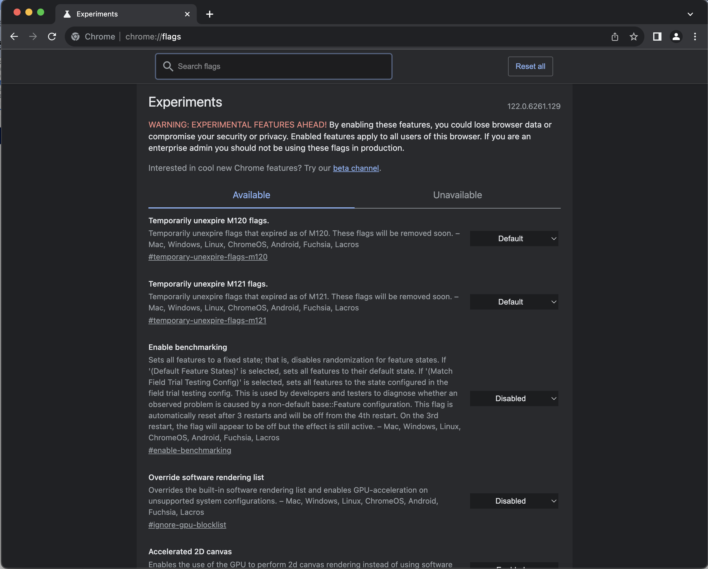
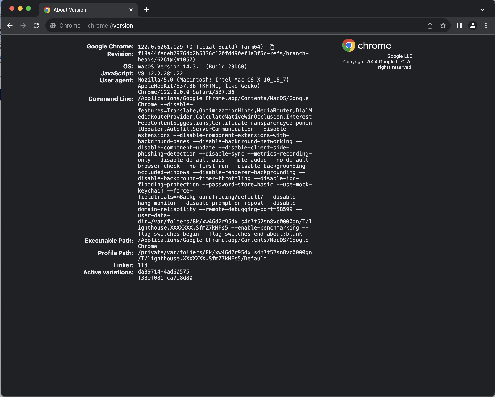
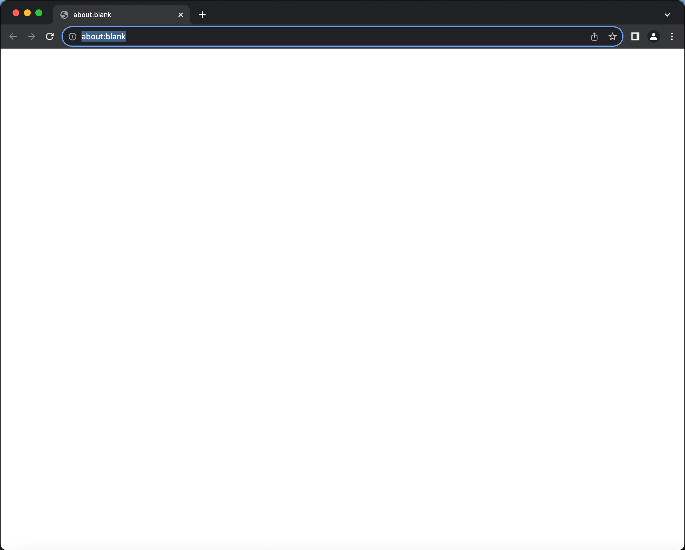
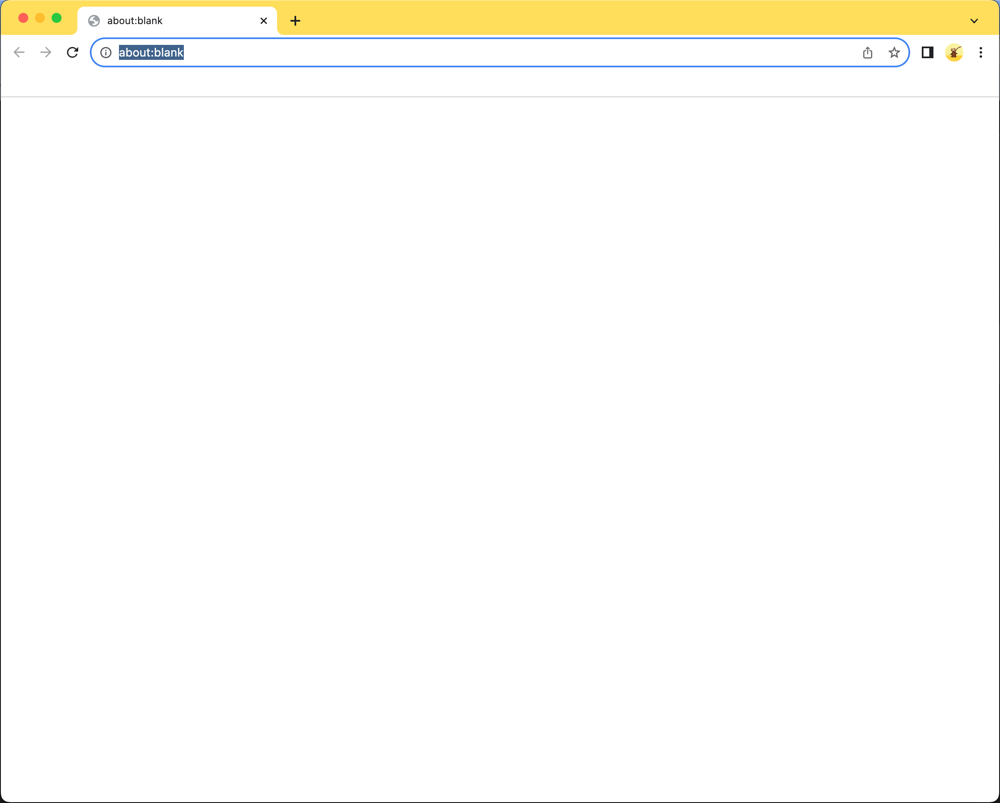
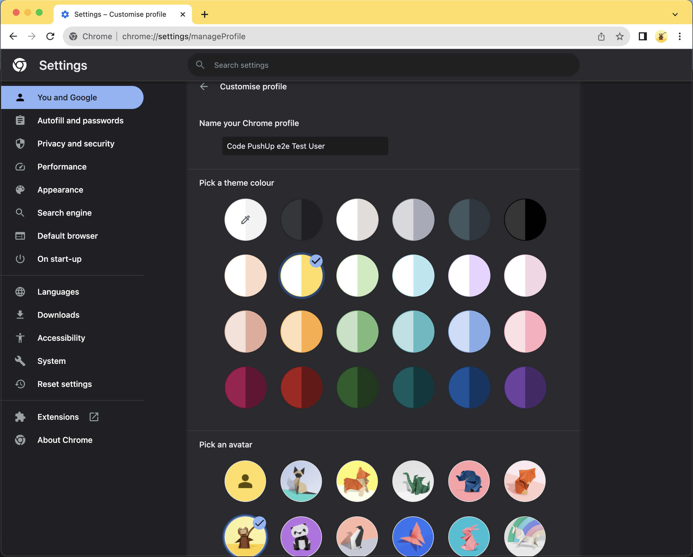
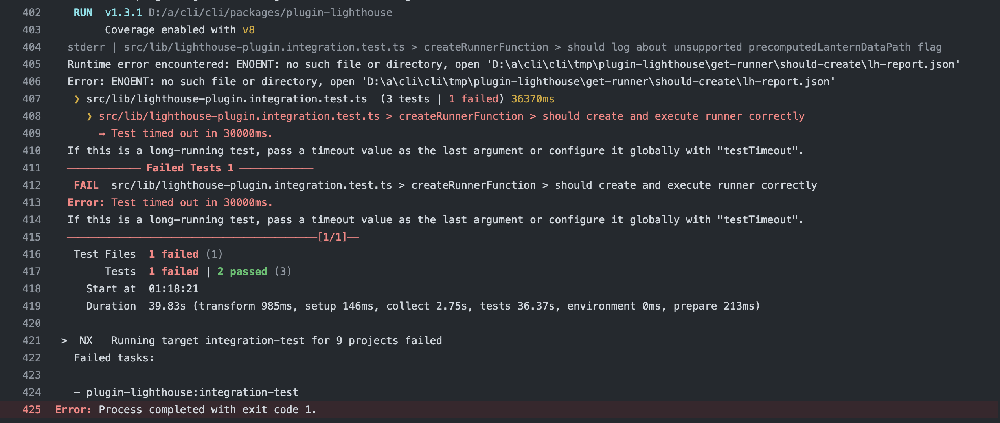
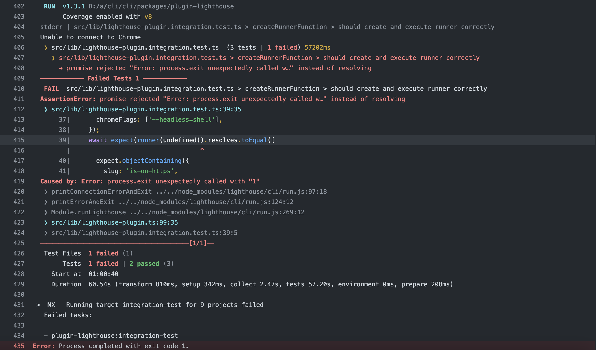
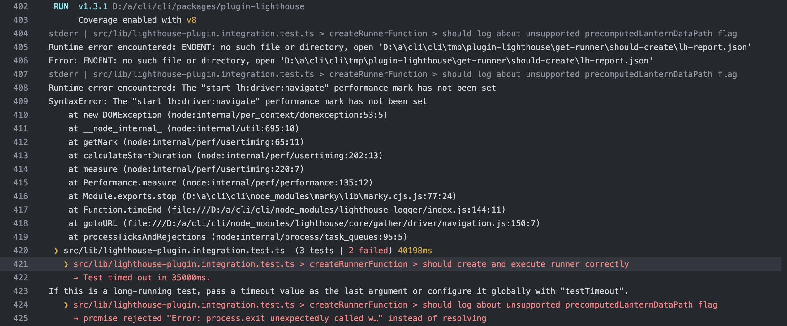

# Contributing

## Setup

Make sure to install dependencies:

```sh
npm install
```

### Chrome path

In this plugin we provide Lighthouse functionality exposed over the `lighthousePlugin`.
To test lighthouse properly we work with a predefined testing setup.

On some OS there could be a problem finding the path to Chrome.

We try to detect it automatically in the [`chrome-path.mock.ts` script](../../testing/test-setup/src/lib/chrome-path.mock.ts).
There we use `getChromePath` and have `chromium` installed as NPM package, so detecting the path should not cause any problem.

However, if no chrome path is detected automatically the error looks like this:

```bash
Runtime error encountered: No Chrome installations found.
```

To prevent this from happening you have to provide the path manually in your `.env`:

```bash
CUSTOM_CHROME_PATH=/Applications/Google Chrome.app/Contents/MacOS/Google Chrome
```

In the CI you can set a static path if needed over the env variable like this:

```yml
# ...
- name: Set custom Chrome path for Windows only
  if: matrix.os == 'windows-latest'
  run: |
    echo "CUSTOM_CHROME_PATH=C:\\Program Files\\Google\\Chrome\\Application\\chrome.exe" | Out-File -FilePath $env:GITHUB_ENV -Append -Encoding utf8
  shell: pwsh

# Optional debug log
- name: Log all environment variables
  run: printenv
# ...
```

We consider this path in our `beforeAll` hook in a [`chrome-path.mock.ts` script](../../testing/test-setup/src/lib/chrome-path.mock.ts).

### Testing chrome flags

1. run `npx chrome-debug --<chromium-flag>` to pass terminal arguments to Chrome. E.g. `npx chrome-debug --headless=shell`.
   `npx chrome-debug --headless=shell --@TODO-PUT-OTHER-EXAMPLE-FOR-FLAG`

For a full list of available flags check out [this document](https://peter.sh/experiments/chromium-command-line-switches/).

> [!NOTE]
> To pass chrome flags to lighthouse you have to provide them under `--chrome-flags="<chrome-flags-as-array>"`.
> E.g. `lighthouse https://example.com --chrome-flage="--headless=shell"`

2. Check if the flag got accepted. This is quite unintuitive as we would expect the passed flag to be visible under `chrome://flags/` but as you can see in the screenshot it is not visible.
   
   Instead open `chrome://version/` and look under the "Command Line" section.  
   

### Chrome User Data

To bootstrap Chrome with a predefined for setting we have to provide a couple of config files that we located under `<project-root>/mock/chromium-user-data`.
When executing Lighthouse we provide the path to this folder over the `Flag` object.

To generate initialise or edit the file structure under `chromium-user-data` do the following steps:

1. Spin up Chrome by running `npx chrome-debug --user-data-dir=./packages/plugin-lighthouse/mock/chromium-user-data`
   

2. If you do this the first time you should already see content under `<project-root>/mock/chromium-user-data`
3. Edit the configuration over the Chrome UI. E.g. adding a profile
4. Close chromium and open it again, and you should see chromium bootstraps as the configured user
   

To reset the above just delete the folder and apply the settings again.

_A helpful chromium setup is preconfigured with the following settings:_

- A user profile is set up. This enables certain debugging related options as well as help to visually distinguish between test setups as the header bar is colored.
  

#### Resources

- [chromium flags guide](https://www.chromium.org/developers/how-tos/run-chromium-with-flags/)

## Troubleshooting

1. Verify Chrome Installation  
   Ensure Chrome is correctly installed and accessible to the Lighthouse process.
   Run `npx chrome-debug` to test it. Read further under [chrome-path](#chrome-path)

2. Increase Timeout  
   Lighthouse has a longer runtime which can time out in different environments.
   **Try increasing the test timeout** in `lighthouse-plugin.int.test.ts` for `runner creation and execution` test suite.

3. Turn on debug mode  
   Show debug logs of Lighthouse. Set the following environment variable: `DEBUG='*'`

4. Understand error messages (⏳ could also be because of timeout problems :D )

- Lighthouse error - `Runtime error encountered: No Chrome installations found.`
  Read further under [chrome-path](#chrome-path)
- Could not find `report.json` (⏳)
  
- Lighthouse Error - `Could Not Connect to Chrome` (⏳)
  
  Your Chrome path is set incorrectly. Read further under [chrome-path](#chrome-path)
- Lighthouse Error - `start lh:<any>:<performancemark>" performance mark has not been set` (⏳)  
  
  If this error pops up you are able to launch Chrome but had problems to communicate over the ports.
