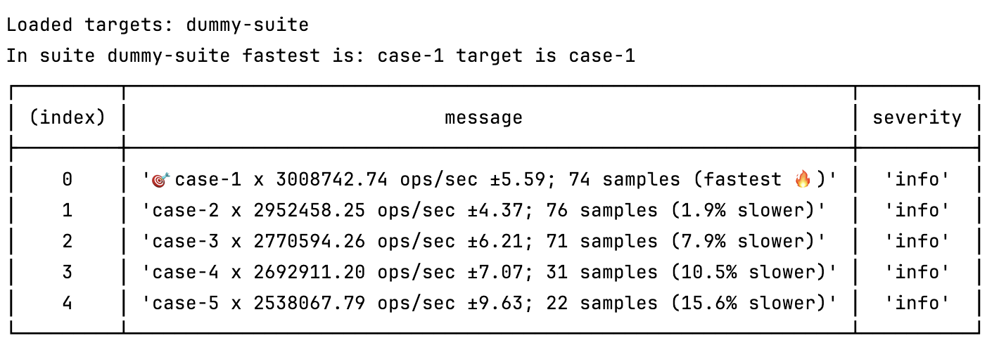

# Micro Benchmarks

## CLI

Execute any benchmark by running `node ./benchmark/bin.js --targets <filepath>`

**Result:**  


## Helper

```ts
import { type SuiteConfig, runSuit } from './benchmark/suite-helper.ts';

const suite: SuiteConfig = {
  suiteName: 'dummy-suite',
  targetImplementation: 'version-2',
  cases: [
    ['version-1', async () => new Promise(resolve => setTimeout(resolve, 30))],
    ['version-2', async () => new Promise(resolve => setTimeout(resolve, 50))],
    ['version-3', async () => new Promise(resolve => setTimeout(resolve, 80))],
  ],
};
const results = await runSuite(suite);
console.log(`Fastest is: ${results.filter(({ isFastest }) => isFastest)}`);
```
