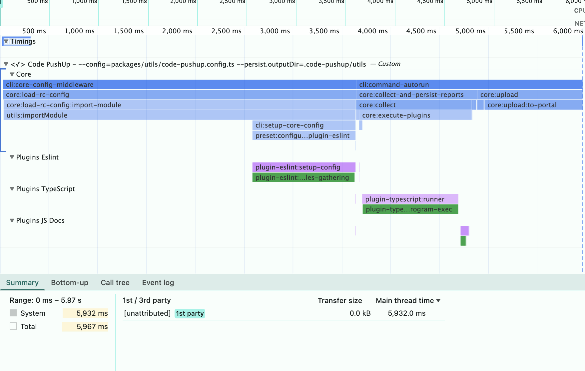
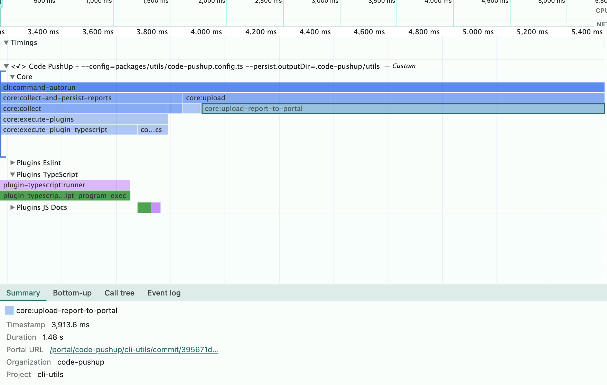
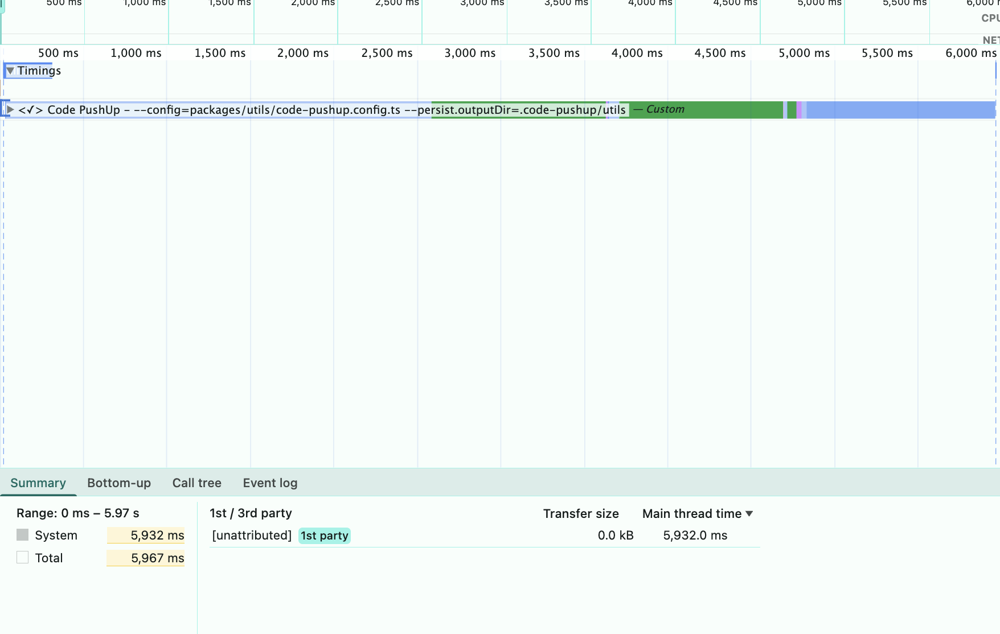
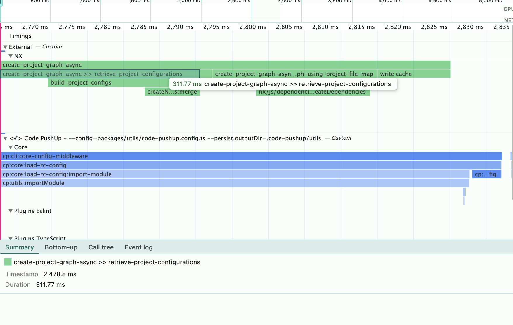
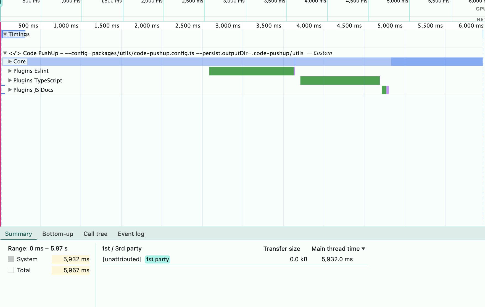
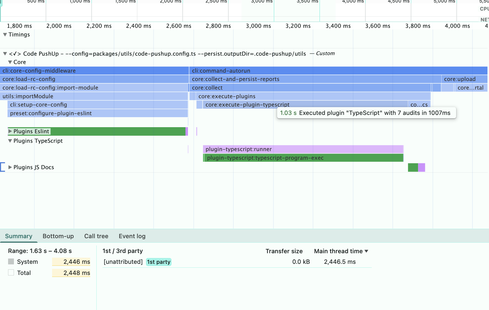
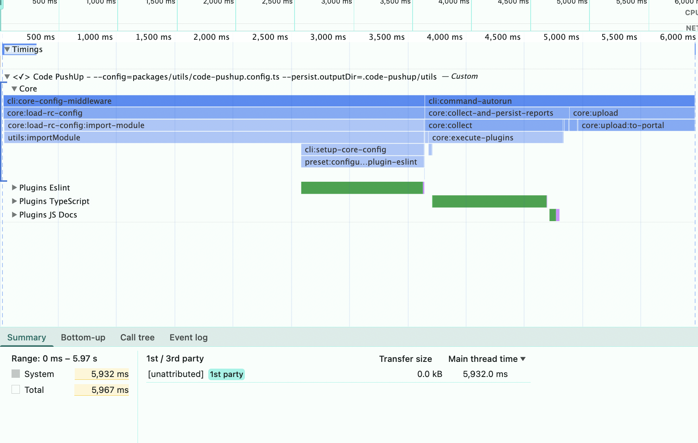
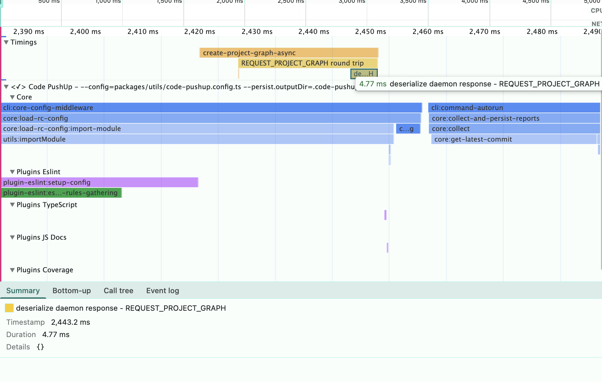
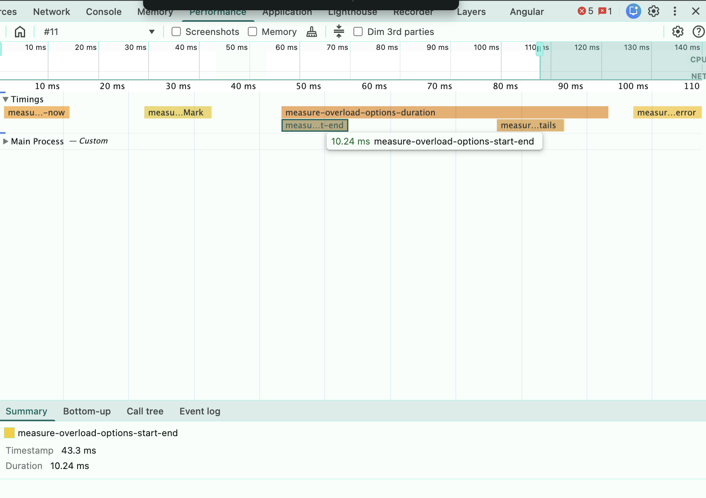
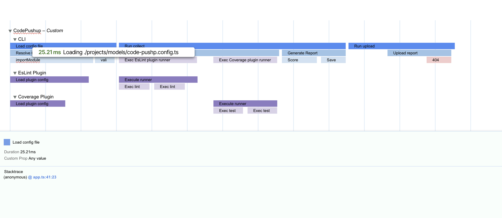

# Code PushUp Profiler

A performance profiling tool that captures timing data in Chrome DevTools trace format for visualization and analysis.

## Usage

```typescript
import { getProfiler } from '@code-pushup/profiler';

const profiler = getProfiler({
  enabled: true,
  outDir: 'tmp/profiles',
  fileBaseName: 'app-timing',
});

profiler.span('load-config', () => loadConfig());
await profiler.spanAsync('process-data', async () => {
  return await processLargeDataset();
});
profiler.instant('app-ready');
profiler.close();
```

## Configuration

```typescript
export type ProfilerOptions<K extends string = never> = {
  enabled?: boolean; // Enable/disable profiling (default: env.CP_PROFILING)
  outDir?: string; // Output directory (default: 'tmp/profiles')
  fileBaseName?: string; // Base name for output files (default: 'timing.profile')
  metadata?: Record<string, unknown>; // Custom metadata to include
  spans?: Partial<DevtoolsSpansRegistry<K>>; // Custom span definitions
};
```

## Type Safety

For enhanced autocomplete and type safety when using native `performance.mark()` and `performance.measure()` with DevTools options, import the type declarations:

```typescript
import '@code-pushup/profiler/perf_hooks';

// Now performance.mark and performance.measure have DevTools-aware overloads
performance.mark('my-event', {
  detail: {
    devtools: {
      dataType: 'marker',
      color: 'primary',
      tooltipText: 'Custom event with DevTools metadata',
    },
  },
});

performance.measure('operation-duration', {
  start: 'start-mark',
  end: 'end-mark',
  detail: {
    devtools: {
      dataType: 'track-entry',
      track: 'my-track',
      color: 'secondary',
    },
  },
});
```

## Features










## User Timing

User Timing API is supported in both Browser and Node.js environments.
It allows you to create custom timing marks and measures that can be visualized in profiling tools.

The Public API includes:

- `profiler.mark(name: string)`: Create a timing mark.
- `profiler.measure(name: string, startMark?: string, endMark?: string)`: Create a timing measure.
- `console.time(name: string): Start a timer`: Create a timing mark.
- `console.timeEnd(name: string)`: End a timer and create a timing measure.

This is reflected in the Timing Track in ChromeDevtools.



### Extensibility API

The Chrome DevTools trace format supports custom event types and metadata enabling us to extend profiling capabilities with tracks, colors, label's and more.
We can leverage the capabilities by adding `PerformanceEntry` details under the `devtools` property.

Official documentation: https://developer.chrome.com/docs/devtools/performance/extension?hl=de
See [user-timing-details.type.ts](src/lib/user-timing-details.type.ts) and [perf_hooks.d.ts](src/perf_hooks.d.ts) for global type extensions.



#### Marker

Labels are special marker that sti at the top of the trace view and create a vertical line across all tracks for easy identification.

```typescript
import { DevToolsLabel } from './user-timing-details.type';

profiler.mark('app-run:start', {
  devtools: {
    dataType: 'marker',
  } satisfies DevToolsLabel,
});
```

### Track Entries aka Spans and Instant

### Track Entries Instant

Markers are instantaneous events that denote specific points in time during the execution of a program.

```typescript
profiler.mark('cli:start', {
  devtools: {
    dataType: 'track-entry',
    track: 'cli',
  } satisfies DevtoolsMarkerDetails,
});
```

### Track Entries Spans

Spans represent a duration of time during which a specific operation or task is performed.

```typescript
profiler.measure('app-run', {
  start: 'app-run:start',
  end: 'app-run:end',
  detail: {
    devtools: {
      dataType: 'track-entry',
      track: 'cli',
    } satisfies DevtoolsSpanDetails,
  },
});
```

### Tracks and TrackGroups

Tracks are horizontal lanes in the timeline that group related events together.
We can think of groups being processes and tracks being threads within those processes.

They are controlled over the `track` and `trackGroup` property in the `devtools` details.

```typescript
import { DevToolsTrackEntry } from './user-timing-details.type';

profiler.measure('app-run', {
  start: 'app-run:start',
  end: 'app-run:end',
  detail: {
    devtools: {
      track: 'cli',
      trackGroup: 'code-pushup',
    } satisfies DevToolsTrackEntry,
  },
});
```

By default, any entry with devtools.dataType `marker` or `track-entry` and `track` set, will show up in a track with the label "Custom Track - _Custom_".

### Styling and Metadata

```typescript
import { DevToolsLabel } from './user-timing-details.type';

profiler.mark('app-run:start', {
  devtools: {
    color: 'secondary', // 'primary' is default
    tooltiptext: 'Application run started', // shown on hover
    // visible in details pane on click
    properties: [['key', 'value']],
  } satisfies DevToolsLabel,
});
```
